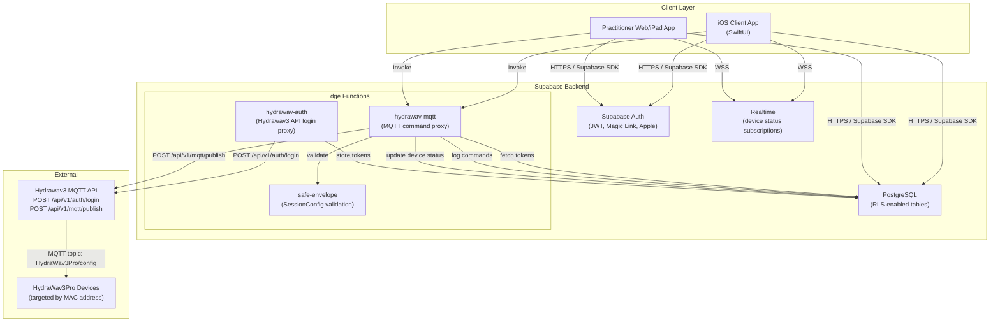
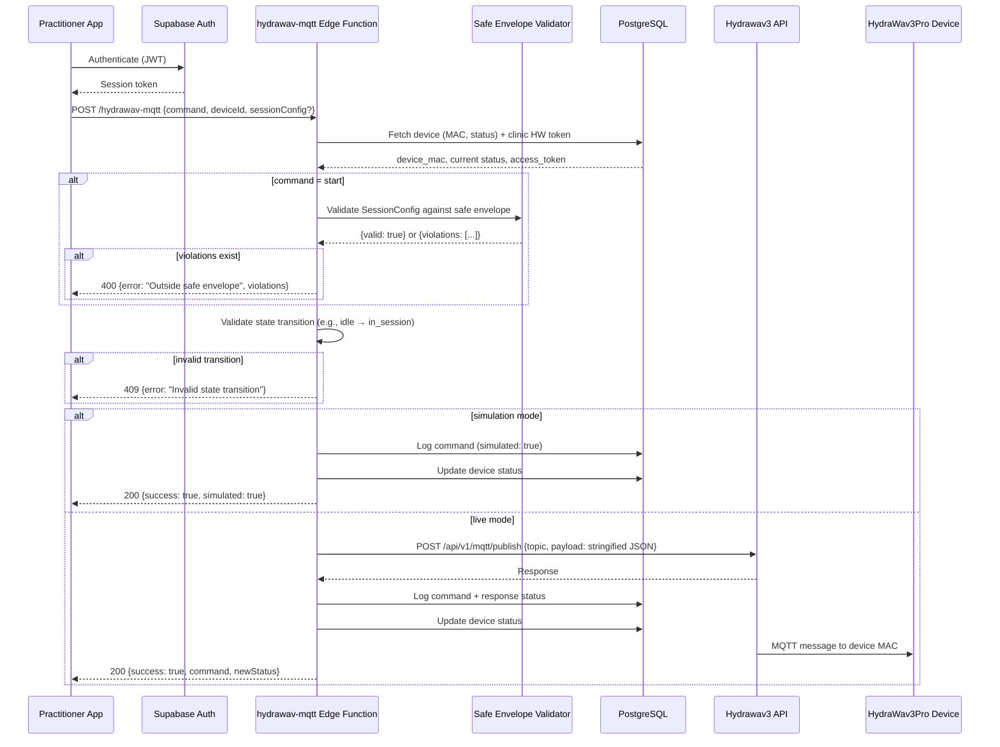
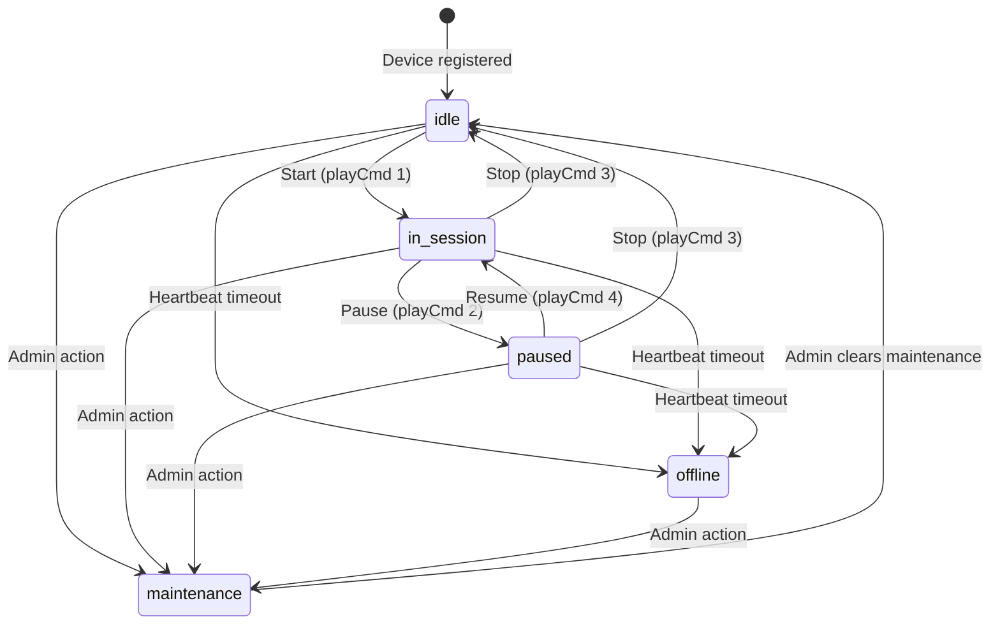

# Design Document — Backend Foundation

## Overview

This design covers the foundational backend for HydraScan: a Turborepo monorepo scaffold, Supabase-backed multi-tenant data layer with Row Level Security, JWT authentication with email magic link and Apple Sign-In, user role management (client/practitioner/admin), device registry with lifecycle state machine, MQTT proxy for Hydrawav3 device control, SessionConfig type definitions with safe envelope validation, and audit logging.

The backend foundation is Spec 1 of 4. All other HydraScan specs (iOS Assessment Pipeline, Recovery Intelligence Dashboard, Outcomes Analytics Integration) depend on the tables, types, auth flows, and Edge Functions established here.

### Key Design Decisions

1. **Turborepo over Nx** — Lighter configuration, zero-config TypeScript workspace support, faster cold starts. Sufficient for a 4-person team with 3 workspace packages.
2. **Supabase over Firebase/InsForge** — PostgreSQL with native RLS for multi-tenant isolation, built-in JWT auth, Edge Functions (Deno/TypeScript), and Realtime subscriptions. The team is familiar with it and the free tier covers hackathon needs.
3. **Edge Functions for server-side logic** — Deno-based serverless functions handle the MQTT proxy, auth proxy, and safe envelope validation. They run close to the database and can use the service role key for privileged operations.
4. **Simulation mode as first-class** — The MQTT proxy operates identically in simulation and live mode, differing only in whether the HTTP call to the Hydrawav3 API is made. This lets all four team members develop without hardware.
5. **Clinic-scoped Hydrawav3 tokens** — JWT tokens from the Hydrawav3 API are stored per-clinic in `clinic_hw_tokens`, not per-user. A single set of credentials controls all devices in a clinic.

## Architecture

### High-Level Component Diagram



### Request Flow: MQTT Command



## Components and Interfaces

### 1. Monorepo Structure (Turborepo)

```
hydrascan/
├── turbo.json                      # Turborepo pipeline config
├── package.json                    # Root workspace definition
├── .env.example                    # Template for environment variables
├── .gitignore                      # Includes .env, node_modules, .supabase
├── README.md                       # Setup instructions, branch strategy
│
├── backend/                        # Supabase project
│   ├── package.json
│   └── supabase/
│       ├── config.toml             # Supabase project config
│       ├── migrations/             # Numbered SQL migration files
│       │   ├── 00001_create_clinics.sql
│       │   ├── 00002_create_users.sql
│       │   ├── 00003_create_devices.sql
│       │   ├── 00004_create_client_profiles.sql
│       │   ├── 00005_create_assessments.sql
│       │   ├── 00006_create_sessions.sql
│       │   ├── 00007_create_outcomes.sql
│       │   ├── 00008_create_recovery_graph.sql
│       │   ├── 00009_create_daily_checkins.sql
│       │   ├── 00010_create_clinic_hw_tokens.sql
│       │   ├── 00011_create_mqtt_command_log.sql
│       │   └── 00012_create_rls_policies.sql
│       ├── functions/
│       │   ├── hydrawav-auth/index.ts
│       │   ├── hydrawav-mqtt/index.ts
│       │   └── _shared/                # Shared utilities for Edge Functions
│       │       ├── cors.ts
│       │       ├── supabase-client.ts
│       │       └── safe-envelope.ts
│       └── seed/
│           └── seed.sql                # Combined seed file for all mock data
│
├── shared/                         # Shared TypeScript types package
│   ├── package.json                # name: "@hydrascan/shared"
│   ├── tsconfig.json
│   └── src/
│       ├── index.ts                # Re-exports everything
│       ├── types/
│       │   ├── session-config.ts   # SessionConfig, ModalityFunc, PlayCmd
│       │   ├── safe-envelope.ts    # SafeEnvelope, SAFE_ENVELOPES, region overrides
│       │   ├── user.ts             # UserRole, User
│       │   ├── device.ts           # DeviceStatus, Device
│       │   ├── client-profile.ts   # ClientProfile, RecoverySignal, BodyRegion
│       │   ├── session.ts          # SessionStatus, Session
│       │   └── assessment.ts       # AssessmentType, Assessment
│       ├── constants/
│       │   ├── body-regions.ts     # BodyRegion enum values
│       │   ├── safe-ranges.ts      # Default + region-specific safe ranges
│       │   └── language-guardrails.ts  # FORBIDDEN_TERMS, PREFERRED_REPLACEMENTS
│       └── validation/
│           ├── safe-envelope.ts    # validateSafeEnvelope()
│           ├── wellness-language.ts # validateWellnessLanguage()
│           └── device-state.ts     # isValidTransition()
│
└── docs/
    └── HydraScan_Agent_Build_Spec.md
```

### 2. Turborepo Configuration

```json
// turbo.json
{
  "$schema": "https://turbo.build/schema.json",
  "pipeline": {
    "build": {
      "dependsOn": ["^build"],
      "outputs": ["dist/**"]
    },
    "typecheck": {
      "dependsOn": ["^build"]
    },
    "test": {
      "dependsOn": ["build"]
    },
    "lint": {}
  }
}
```

Root `package.json` workspaces:
```json
{
  "private": true,
  "workspaces": ["backend", "shared"],
  "devDependencies": {
    "turbo": "^2.0.0",
    "typescript": "^5.4.0"
  }
}
```

### 3. Edge Function Interfaces

#### hydrawav-auth

**Purpose:** Proxy authentication to the Hydrawav3 API and store clinic-scoped JWT tokens.

```typescript
// POST /functions/v1/hydrawav-auth
// Headers: Authorization: Bearer <supabase_jwt>

interface HydrawavAuthRequest {
  username: string;
  password: string;
}

interface HydrawavAuthResponse {
  success: boolean;
  error?: string;
}
```

**Behavior:**
- Verifies the caller is an admin for the clinic (via Supabase JWT → users table lookup)
- POSTs to `{HYDRAWAV_API_BASE_URL}/api/v1/auth/login` with `{username, password, rememberMe: true}`
- On success, upserts `clinic_hw_tokens` with the access and refresh tokens
- On failure, returns 401 with error message

#### hydrawav-mqtt

**Purpose:** Validate, serialize, and publish MQTT commands to the Hydrawav3 API on behalf of a clinic.

```typescript
// POST /functions/v1/hydrawav-mqtt
// Headers: Authorization: Bearer <supabase_jwt>

interface MqttCommandRequest {
  deviceId: string;          // UUID of the device in the registry
  command: 'start' | 'pause' | 'resume' | 'stop';
  sessionConfig?: SessionConfig;  // Required only for 'start'
  bodyRegion?: BodyRegion;        // Optional: used for region-specific safe envelope
}

interface MqttCommandResponse {
  success: boolean;
  simulated: boolean;
  command: string;
  deviceMac: string;
  newStatus: DeviceStatus;
  error?: string;
  violations?: SafeEnvelopeViolation[];
}

interface SafeEnvelopeViolation {
  parameter: string;
  actual: number;
  min: number;
  max: number;
}
```

**Behavior:**
1. Extract `clinic_id` from the authenticated user's JWT
2. Fetch device record (MAC, current status) and clinic HW token from DB
3. Validate state transition is legal (see Device Lifecycle State Machine)
4. For `start` commands: validate SessionConfig against safe envelope (with optional region overrides)
5. Build payload: full SessionConfig for `start`, minimal `{mac, playCmd}` for pause/stop/resume
6. If simulation mode: skip HTTP call, log with `simulated: true`, return success
7. If live mode: POST to `/api/v1/mqtt/publish` with `{topic: "HydraWav3Pro/config", payload: JSON.stringify(payload)}`
8. Update device status in registry
9. Insert audit log record

### 4. Shared Validation Functions

#### Safe Envelope Validator

```typescript
// shared/src/validation/safe-envelope.ts

function validateSafeEnvelope(
  config: SessionConfig,
  region?: BodyRegion
): { valid: boolean; violations: SafeEnvelopeViolation[] }
```

Merges `SAFE_ENVELOPES._default` with any region-specific overrides (e.g., `neck`, `lower_back`), then checks every numeric parameter against its min/max range. Returns all violations, not just the first.

#### Device State Transition Validator

```typescript
// shared/src/validation/device-state.ts

function isValidTransition(
  currentStatus: DeviceStatus,
  command: 'start' | 'pause' | 'resume' | 'stop' | 'maintenance'
): boolean
```

Encodes the state machine rules. See the state machine diagram below.

#### Wellness Language Validator

```typescript
// shared/src/validation/wellness-language.ts

function validateWellnessLanguage(
  text: string
): { valid: boolean; violations: WellnessViolation[] }

interface WellnessViolation {
  term: string;
  replacement: string;
  position: number;
}
```

Scans text against `FORBIDDEN_TERMS` and returns violations with suggested replacements from `PREFERRED_REPLACEMENTS`.

### 5. Device Lifecycle State Machine



**Valid transitions table:**

| Current Status | Command | New Status | Allowed? |
|---|---|---|---|
| `idle` | `start` | `in_session` | ✅ |
| `in_session` | `pause` | `paused` | ✅ |
| `paused` | `resume` | `in_session` | ✅ |
| `in_session` | `stop` | `idle` | ✅ |
| `paused` | `stop` | `idle` | ✅ |
| `idle` | `pause` | — | ❌ |
| `idle` | `resume` | — | ❌ |
| `idle` | `stop` | — | ❌ |
| `maintenance` | `start` | — | ❌ |
| `offline` | `start` | — | ❌ |
| any | `maintenance` | `maintenance` | ✅ (admin only) |

### 6. RLS Policy Design

All data tables use a common pattern: filter rows by matching the authenticated user's `clinic_id`.

**Lookup helper** (used in all policies):
```sql
-- Get the clinic_id for the currently authenticated user
(SELECT clinic_id FROM users WHERE id = auth.uid())
```

**Policy matrix:**

| Table | SELECT | INSERT | UPDATE | DELETE |
|---|---|---|---|---|
| `users` | Same clinic | Admin only | Own record or admin | Admin only |
| `devices` | Same clinic | Admin only | Admin + practitioner (status only) | Admin only |
| `client_profiles` | Client: own only; Practitioner/Admin: same clinic | System (on registration) | Client: own; Practitioner: same clinic | Admin only |
| `assessments` | Client: own; Practitioner/Admin: same clinic | Practitioner + system | Practitioner | — |
| `sessions` | Client: own; Practitioner/Admin: same clinic | Practitioner | Practitioner | — |
| `outcomes` | Client: own; Practitioner/Admin: same clinic | Client + practitioner | Author only | — |
| `recovery_graph` | Client: own; Practitioner/Admin: same clinic | System | System | — |
| `daily_checkins` | Client: own; Practitioner/Admin: same clinic | Client | Client (own) | — |
| `clinic_hw_tokens` | Admin only | Admin (via Edge Function) | Admin (via Edge Function) | Admin only |
| `mqtt_command_log` | Admin + practitioner (same clinic) | System (Edge Function) | — | — |

**Role-differentiated SELECT example for `client_profiles`:**

```sql
CREATE POLICY "client_sees_own_profile" ON client_profiles
  FOR SELECT USING (
    user_id = auth.uid()
  );

CREATE POLICY "practitioner_sees_clinic_profiles" ON client_profiles
  FOR SELECT USING (
    clinic_id = (SELECT clinic_id FROM users WHERE id = auth.uid())
    AND (SELECT role FROM users WHERE id = auth.uid()) IN ('practitioner', 'admin')
  );
```

## Data Models

### Database Schema

All tables use UUID primary keys with `gen_random_uuid()` defaults and `TIMESTAMPTZ` timestamps.

#### clinics
```sql
CREATE TABLE clinics (
  id            UUID PRIMARY KEY DEFAULT gen_random_uuid(),
  name          TEXT NOT NULL,
  address       TEXT,
  timezone      TEXT DEFAULT 'America/Phoenix',
  created_at    TIMESTAMPTZ DEFAULT now(),
  updated_at    TIMESTAMPTZ DEFAULT now()
);
```

#### users
```sql
CREATE TABLE users (
  id            UUID PRIMARY KEY DEFAULT gen_random_uuid(),
  clinic_id     UUID REFERENCES clinics(id) NOT NULL,
  role          TEXT NOT NULL CHECK (role IN ('client', 'practitioner', 'admin')),
  email         TEXT UNIQUE,
  full_name     TEXT NOT NULL,
  phone         TEXT,
  date_of_birth DATE,
  auth_provider TEXT,
  avatar_url    TEXT,
  created_at    TIMESTAMPTZ DEFAULT now(),
  updated_at    TIMESTAMPTZ DEFAULT now()
);
```

#### devices
```sql
CREATE TABLE devices (
  id                    UUID PRIMARY KEY DEFAULT gen_random_uuid(),
  clinic_id             UUID REFERENCES clinics(id) NOT NULL,
  device_mac            TEXT NOT NULL,
  label                 TEXT NOT NULL,
  room                  TEXT,
  assigned_practitioner UUID REFERENCES users(id),
  status                TEXT DEFAULT 'idle'
                        CHECK (status IN ('idle', 'in_session', 'paused', 'maintenance', 'offline')),
  last_session_id       UUID,
  firmware              TEXT,
  created_at            TIMESTAMPTZ DEFAULT now(),
  updated_at            TIMESTAMPTZ DEFAULT now(),
  UNIQUE(clinic_id, device_mac)
);
```

#### client_profiles
```sql
CREATE TABLE client_profiles (
  id                  UUID PRIMARY KEY DEFAULT gen_random_uuid(),
  user_id             UUID REFERENCES users(id) NOT NULL UNIQUE,
  clinic_id           UUID REFERENCES clinics(id) NOT NULL,
  primary_regions     JSONB DEFAULT '[]',
  recovery_signals    JSONB DEFAULT '{}',
  goals               TEXT[],
  activity_context    TEXT,
  sensitivities       TEXT[],
  notes               TEXT,
  wearable_hrv        NUMERIC,
  wearable_strain     NUMERIC,
  wearable_sleep_score NUMERIC,
  wearable_last_sync  TIMESTAMPTZ,
  created_at          TIMESTAMPTZ DEFAULT now(),
  updated_at          TIMESTAMPTZ DEFAULT now()
);
```

#### assessments
```sql
CREATE TABLE assessments (
  id                      UUID PRIMARY KEY DEFAULT gen_random_uuid(),
  client_id               UUID REFERENCES client_profiles(id) NOT NULL,
  clinic_id               UUID REFERENCES clinics(id) NOT NULL,
  practitioner_id         UUID REFERENCES users(id),
  assessment_type         TEXT NOT NULL CHECK (assessment_type IN ('intake', 'pre_session', 'follow_up', 'reassessment')),
  quickpose_data          JSONB,
  rom_values              JSONB,
  asymmetry_scores        JSONB,
  movement_quality_scores JSONB,
  gait_metrics            JSONB,
  heart_rate              NUMERIC,
  breath_rate             NUMERIC,
  hrv_rmssd               NUMERIC,
  body_zones              JSONB,
  recovery_goal           TEXT,
  subjective_baseline     JSONB,
  recovery_map            JSONB,
  recovery_graph_delta    JSONB,
  created_at              TIMESTAMPTZ DEFAULT now()
);
```

#### sessions
```sql
CREATE TABLE sessions (
  id                     UUID PRIMARY KEY DEFAULT gen_random_uuid(),
  client_id              UUID REFERENCES client_profiles(id) NOT NULL,
  clinic_id              UUID REFERENCES clinics(id) NOT NULL,
  practitioner_id        UUID REFERENCES users(id) NOT NULL,
  device_id              UUID REFERENCES devices(id) NOT NULL,
  assessment_id          UUID REFERENCES assessments(id),
  session_config         JSONB NOT NULL,
  recommended_config     JSONB,
  practitioner_edits     JSONB,
  recommendation_rationale TEXT,
  confidence_score       NUMERIC,
  status                 TEXT DEFAULT 'pending'
                         CHECK (status IN ('pending', 'active', 'paused', 'completed', 'cancelled', 'error')),
  started_at             TIMESTAMPTZ,
  paused_at              TIMESTAMPTZ,
  resumed_at             TIMESTAMPTZ,
  completed_at           TIMESTAMPTZ,
  total_duration_s       INTEGER,
  outcome                JSONB,
  practitioner_notes     TEXT,
  retest_values          JSONB,
  created_at             TIMESTAMPTZ DEFAULT now(),
  updated_at             TIMESTAMPTZ DEFAULT now()
);
```

#### outcomes
```sql
CREATE TABLE outcomes (
  id                  UUID PRIMARY KEY DEFAULT gen_random_uuid(),
  session_id          UUID REFERENCES sessions(id) NOT NULL,
  client_id           UUID REFERENCES client_profiles(id) NOT NULL,
  recorded_by         TEXT NOT NULL CHECK (recorded_by IN ('client', 'practitioner')),
  stiffness_before    INTEGER CHECK (stiffness_before BETWEEN 0 AND 10),
  stiffness_after     INTEGER CHECK (stiffness_after BETWEEN 0 AND 10),
  soreness_before     INTEGER CHECK (soreness_before BETWEEN 0 AND 10),
  soreness_after      INTEGER CHECK (soreness_after BETWEEN 0 AND 10),
  mobility_improved   BOOLEAN,
  session_effective   BOOLEAN,
  readiness_improved  BOOLEAN,
  repeat_intent       TEXT CHECK (repeat_intent IN ('yes', 'maybe', 'no')),
  rom_after           JSONB,
  rom_delta           JSONB,
  client_notes        TEXT,
  practitioner_notes  TEXT,
  created_at          TIMESTAMPTZ DEFAULT now()
);
```

#### recovery_graph
```sql
CREATE TABLE recovery_graph (
  id            UUID PRIMARY KEY DEFAULT gen_random_uuid(),
  client_id     UUID REFERENCES client_profiles(id) NOT NULL,
  body_region   TEXT NOT NULL,
  metric_type   TEXT NOT NULL,
  value         NUMERIC NOT NULL,
  source        TEXT NOT NULL,
  source_id     UUID,
  recorded_at   TIMESTAMPTZ DEFAULT now()
);

CREATE INDEX idx_recovery_graph_client_region
  ON recovery_graph(client_id, body_region, recorded_at DESC);
```

#### daily_checkins
```sql
CREATE TABLE daily_checkins (
  id              UUID PRIMARY KEY DEFAULT gen_random_uuid(),
  client_id       UUID REFERENCES client_profiles(id) NOT NULL,
  checkin_type    TEXT NOT NULL CHECK (checkin_type IN ('daily', 'post_activity', 'pre_visit')),
  overall_feeling INTEGER CHECK (overall_feeling BETWEEN 1 AND 5),
  target_regions  JSONB,
  activity_since_last TEXT,
  recovery_score  NUMERIC,
  created_at      TIMESTAMPTZ DEFAULT now()
);
```

#### clinic_hw_tokens
```sql
CREATE TABLE clinic_hw_tokens (
  id              UUID PRIMARY KEY DEFAULT gen_random_uuid(),
  clinic_id       UUID REFERENCES clinics(id) NOT NULL UNIQUE,
  access_token    TEXT NOT NULL,
  refresh_token   TEXT NOT NULL,
  created_at      TIMESTAMPTZ DEFAULT now(),
  updated_at      TIMESTAMPTZ DEFAULT now()
);
```

#### mqtt_command_log
```sql
CREATE TABLE mqtt_command_log (
  id                    UUID PRIMARY KEY DEFAULT gen_random_uuid(),
  clinic_id             UUID REFERENCES clinics(id) NOT NULL,
  device_id             UUID REFERENCES devices(id) NOT NULL,
  command               TEXT NOT NULL,
  payload               JSONB NOT NULL,
  mqtt_response_status  INTEGER,
  error_details         TEXT,
  simulated             BOOLEAN DEFAULT false,
  created_at            TIMESTAMPTZ DEFAULT now()
);
```

### TypeScript Type Definitions (shared package)

#### Core Enums and Types

```typescript
// shared/src/types/user.ts
export type UserRole = 'client' | 'practitioner' | 'admin';

// shared/src/types/device.ts
export type DeviceStatus = 'idle' | 'in_session' | 'paused' | 'maintenance' | 'offline';

// shared/src/types/session.ts
export type SessionStatus = 'pending' | 'active' | 'paused' | 'completed' | 'cancelled' | 'error';

// shared/src/types/assessment.ts
export type AssessmentType = 'intake' | 'pre_session' | 'follow_up' | 'reassessment';
```

#### BodyRegion

```typescript
// shared/src/types/client-profile.ts
export type BodyRegion =
  | 'right_shoulder' | 'left_shoulder'
  | 'right_hip' | 'left_hip'
  | 'lower_back' | 'upper_back'
  | 'right_knee' | 'left_knee'
  | 'neck'
  | 'right_calf' | 'left_calf'
  | 'right_arm' | 'left_arm'
  | 'right_foot' | 'left_foot';

export type RecoveryGoal = 'mobility' | 'warm_up' | 'recovery' | 'relaxation' | 'performance_prep';
export type RecoverySignalType = 'stiffness' | 'soreness' | 'tightness' | 'restriction' | 'guarding';

export interface RecoverySignal {
  region: BodyRegion;
  type: RecoverySignalType;
  severity: number;  // 1–10
  trigger: string;
  notes?: string;
}
```

#### SessionConfig

```typescript
// shared/src/types/session-config.ts
export type ModalityFunc = 'leftColdBlue' | 'leftHotRed' | 'rightColdBlue' | 'rightHotRed';
export type PlayCmd = 1 | 2 | 3 | 4;  // 1=Start, 2=Pause, 3=Stop, 4=Resume

export interface SessionConfig {
  mac: string;
  sessionCount: number;
  sessionPause: number;
  sDelay: number;
  cycle1: number;
  cycle5: number;
  edgeCycleDuration: number;
  cycleRepetitions: number[];
  cycleDurations: number[];
  cyclePauses: number[];
  pauseIntervals: number[];
  leftFuncs: ModalityFunc[];
  rightFuncs: ModalityFunc[];
  pwmValues: {
    hot: [number, number, number];
    cold: [number, number, number];
  };
  playCmd: PlayCmd;
  led: 0 | 1;
  hotDrop: number;
  coldDrop: number;
  vibMin: number;
  vibMax: number;
  totalDuration: number;
}
```

#### SafeEnvelope

```typescript
// shared/src/types/safe-envelope.ts
export interface SafeEnvelope {
  pwmHotMin: number;       pwmHotMax: number;
  pwmColdMin: number;      pwmColdMax: number;
  vibMinFloor: number;     vibMinCeiling: number;
  vibMaxFloor: number;     vibMaxCeiling: number;
  hotDropMin: number;      hotDropMax: number;
  coldDropMin: number;     coldDropMax: number;
  edgeCycleDurationMin: number;  edgeCycleDurationMax: number;
}

// shared/src/constants/safe-ranges.ts
export const SAFE_ENVELOPES: Record<string, Partial<SafeEnvelope>> = {
  _default: {
    pwmHotMin: 30,  pwmHotMax: 150,
    pwmColdMin: 100, pwmColdMax: 255,
    vibMinFloor: 10, vibMinCeiling: 50,
    vibMaxFloor: 100, vibMaxCeiling: 255,
    hotDropMin: 1,  hotDropMax: 10,
    coldDropMin: 1, coldDropMax: 10,
    edgeCycleDurationMin: 5, edgeCycleDurationMax: 15,
  },
  neck: {
    pwmHotMax: 100,
    vibMaxCeiling: 180,
  },
  lower_back: {
    pwmHotMax: 120,
    vibMaxCeiling: 200,
  },
};
```

### Environment Configuration

```bash
# .env.example
SUPABASE_URL=https://your-project.supabase.co
SUPABASE_ANON_KEY=eyJ...
SUPABASE_SERVICE_ROLE_KEY=eyJ...
HYDRAWAV_API_BASE_URL=simulation          # Set to actual URL for live mode
LLM_API_KEY=sk-...                        # Claude or OpenAI key
```

- `.env` is in `.gitignore`
- Edge Functions read via `Deno.env.get()`
- `HYDRAWAV_API_BASE_URL` set to `"simulation"` or unset triggers simulation mode
- Switching to live mode requires only changing this one variable

