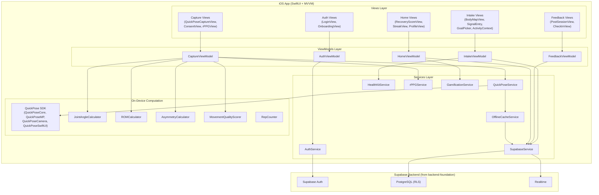
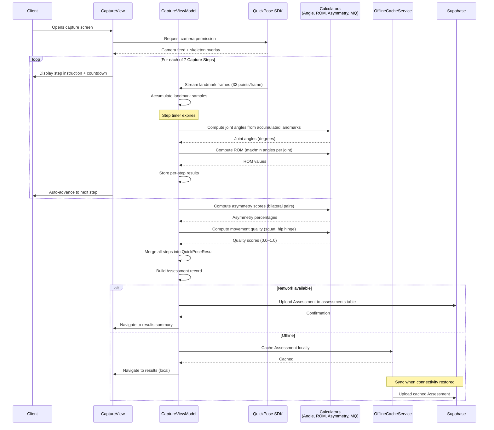
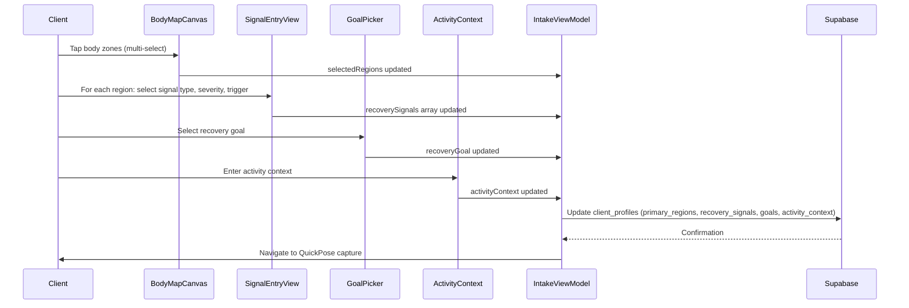
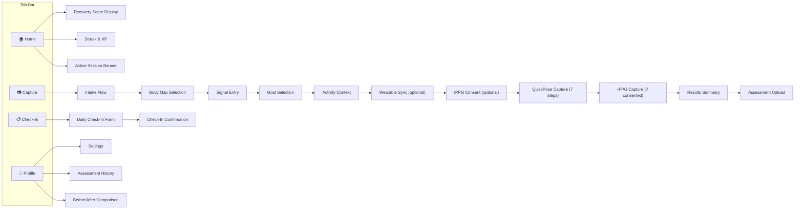

# Design Document — iOS Assessment Pipeline

## Overview

This design covers the iOS client application and on-device QuickPose assessment pipeline for HydraScan, encompassing Phase 3 (QuickPose Assessment Pipeline) and Phase 6 (Client iOS App). The iOS app is a SwiftUI application that handles the full client journey: authentication, rapid intake, guided movement capture with real-time pose estimation, joint angle computation, ROM measurement, asymmetry detection, movement quality scoring, optional rPPG vitals capture, post-session feedback, daily check-ins, Recovery Score display, and continuity/gamification features.

All pose computation runs on-device via the QuickPose SDK (built on MediaPipe). The app communicates with the Supabase backend (defined in the backend-foundation spec) for authentication, data persistence, and real-time subscriptions. No raw video leaves the device — only structured pose data and computed metrics are uploaded.

### Key Design Decisions

1. **SwiftUI-first architecture with MVVM** — SwiftUI is required by the hackathon constraints. MVVM provides clean separation between views, business logic, and data access. Each major feature area gets its own ViewModel.
2. **QuickPose SDK over raw MediaPipe** — QuickPose wraps MediaPipe with SwiftUI-native views (`QuickPoseBasicView`), built-in ROM measurement features, rep counting, and skeleton overlays. This saves significant integration time compared to raw MediaPipe.
3. **On-device computation only** — All pose estimation, joint angle computation, ROM measurement, asymmetry detection, and movement quality scoring run locally. This satisfies the offline resilience requirement and privacy constraints.
4. **Supabase Swift SDK for backend integration** — Uses `supabase-swift` for auth (Apple Sign-In, magic link), database CRUD, and real-time subscriptions. Matches the backend-foundation spec's Supabase architecture.
5. **Local-first with sync** — Assessments are cached locally using SwiftData when offline and synced when connectivity returns. The capture flow never blocks on network availability.
6. **Body map as positioned overlays** — The body map uses a 2D silhouette image with tappable overlay rectangles rather than a complex 3D model. This is fast to build and sufficient for zone selection.
7. **rPPG as optional, consent-gated step** — Face video for heart rate estimation requires explicit consent, processes entirely on-device, and discards raw frames after computation.

## Architecture

### High-Level iOS App Architecture



### Assessment Capture Data Flow



### Intake Flow Sequence



### App Navigation Structure



## Components and Interfaces

### 1. iOS Project Structure

```
ios/HydraScan/
├── App/
│   ├── HydraScanApp.swift              # App entry point, environment setup
│   └── ContentView.swift               # Root view with auth gate + tab bar
├── Models/
│   ├── User.swift                      # User, UserRole
│   ├── ClientProfile.swift             # ClientProfile, RecoverySignal, BodyRegion
│   ├── Assessment.swift                # Assessment, AssessmentType
│   ├── QuickPoseResult.swift           # QuickPoseResult, Landmark
│   ├── RecoveryMap.swift               # RecoveryMap, HighlightedRegion
│   ├── Session.swift                   # Session, SessionStatus
│   ├── Outcome.swift                   # Outcome
│   ├── DailyCheckin.swift              # DailyCheckin
│   ├── RecoveryScore.swift             # RecoveryScore
│   └── GamificationState.swift         # XP, Level, Streak
├── ViewModels/
│   ├── AuthViewModel.swift
│   ├── IntakeViewModel.swift
│   ├── CaptureViewModel.swift
│   ├── FeedbackViewModel.swift
│   └── HomeViewModel.swift
├── Views/
│   ├── Auth/
│   │   ├── LoginView.swift
│   │   └── OnboardingView.swift
│   ├── Client/
│   │   ├── IntakeView.swift
│   │   ├── BodyMapView.swift
│   │   ├── SignalEntryView.swift
│   │   ├── GoalPickerView.swift
│   │   ├── ActivityContextView.swift
│   │   ├── ConsentView.swift
│   │   ├── QuickPoseCaptureView.swift
│   │   ├── rPPGCaptureView.swift
│   │   ├── ResultsSummaryView.swift
│   │   ├── PostSessionView.swift
│   │   ├── CheckInView.swift
│   │   ├── RecoveryScoreView.swift
│   │   ├── StreakView.swift
│   │   └── BeforeAfterView.swift
│   └── Shared/
│       ├── BodyMapCanvas.swift
│       ├── RecoveryScoreGauge.swift
│       ├── TrendLineChart.swift
│       ├── EmojiScalePicker.swift
│       └── StepProgressIndicator.swift
├── Services/
│   ├── AuthService.swift
│   ├── SupabaseService.swift
│   ├── QuickPoseService.swift
│   ├── HealthKitService.swift
│   ├── rPPGService.swift
│   ├── OfflineCacheService.swift
│   └── GamificationService.swift
├── Computation/
│   ├── JointAngleCalculator.swift
│   ├── ROMCalculator.swift
│   ├── AsymmetryCalculator.swift
│   ├── MovementQualityScorer.swift
│   └── RepCounter.swift
└── Utils/
    ├── Constants.swift
    ├── WellnessLanguage.swift
    └── Extensions.swift
```

### 2. Swift Type Definitions

These types mirror the backend-foundation shared types, adapted for Swift.

```swift
// MARK: - Core Enums

enum UserRole: String, Codable {
    case client, practitioner, admin
}

enum BodyRegion: String, Codable, CaseIterable, Hashable {
    case rightShoulder = "right_shoulder"
    case leftShoulder = "left_shoulder"
    case rightHip = "right_hip"
    case leftHip = "left_hip"
    case lowerBack = "lower_back"
    case upperBack = "upper_back"
    case rightKnee = "right_knee"
    case leftKnee = "left_knee"
    case neck
    case rightCalf = "right_calf"
    case leftCalf = "left_calf"
    case rightArm = "right_arm"
    case leftArm = "left_arm"
    case rightFoot = "right_foot"
    case leftFoot = "left_foot"
}

enum RecoveryGoal: String, Codable, CaseIterable {
    case mobility, warmUp = "warm_up", recovery, relaxation, performancePrep = "performance_prep"

    var displayLabel: String {
        switch self {
        case .mobility: return "Improve Mobility"
        case .warmUp: return "Warm Up"
        case .recovery: return "Support Recovery"
        case .relaxation: return "Deep Relaxation"
        case .performancePrep: return "Performance Prep"
        }
    }
}

enum RecoverySignalType: String, Codable, CaseIterable {
    case stiffness, soreness, tightness, restriction, guarding
}

enum ActivityTrigger: String, Codable, CaseIterable {
    case morning, afterRunning = "after_running", afterLifting = "after_lifting"
    case postTravel = "post_travel", postTraining = "post_training", evening, general
}

enum AssessmentType: String, Codable {
    case intake, preSession = "pre_session", followUp = "follow_up", reassessment
}

// MARK: - Recovery Signal

struct RecoverySignal: Codable, Identifiable {
    var id = UUID()
    let region: BodyRegion
    let type: RecoverySignalType
    let severity: Int          // 1–10
    let trigger: ActivityTrigger
    var notes: String?
}

// MARK: - Landmark and Pose Data

struct Landmark: Codable {
    let x: Double
    let y: Double
    let z: Double
    let visibility: Double     // 0.0–1.0 confidence
}

struct QuickPoseResult: Codable {
    let landmarks: [Landmark]                    // 33 points
    let jointAngles: [String: Double]            // e.g. "right_shoulder_flexion": 142.0
    let romValues: [String: Double]              // e.g. "right_shoulder_flexion": 165.0
    let asymmetryScores: [String: Double]        // e.g. "shoulder_flexion": 10.1
    let movementQuality: [String: Double]        // e.g. "squat": 0.82
    let gaitMetrics: GaitMetrics?
    let capturedAt: Date

    struct GaitMetrics: Codable {
        let cadence: Double
        let stepSymmetry: Double
        let stepLength: Double
    }
}

// MARK: - Assessment

struct Assessment: Codable, Identifiable {
    let id: UUID
    let clientId: UUID
    let clinicId: UUID
    var practitionerId: UUID?
    let assessmentType: AssessmentType
    var quickposeData: QuickPoseResult?
    var romValues: [String: Double]?
    var asymmetryScores: [String: Double]?
    var movementQualityScores: [String: Double]?
    var gaitMetrics: QuickPoseResult.GaitMetrics?
    var heartRate: Double?
    var breathRate: Double?
    var hrvRmssd: Double?
    var bodyZones: [[String: Any]]?
    var recoveryGoal: String?
    var subjectiveBaseline: [String: Any]?
    var recoveryMap: RecoveryMap?
    let createdAt: Date
}

// MARK: - Recovery Map

struct RecoveryMap: Codable {
    let clientId: UUID
    let highlightedRegions: [HighlightedRegion]
    let wearableContext: WearableContext?
    let priorSessions: [PriorSessionSummary]
    let suggestedGoal: RecoveryGoal
    let generatedAt: Date

    struct HighlightedRegion: Codable {
        let region: BodyRegion
        let severity: Int
        let signalType: RecoverySignalType
        var romDelta: Double?
        let asymmetryFlag: Bool
        var compensationHint: String?
    }

    struct WearableContext: Codable {
        let hrv: Double
        let strain: Double
        let sleepScore: Double
        let lastSync: Date
    }

    struct PriorSessionSummary: Codable {
        let date: Date
        let configSummary: String
        let outcomeRating: Int
    }
}

// MARK: - Outcome

struct Outcome: Codable, Identifiable {
    let id: UUID
    let sessionId: UUID
    let clientId: UUID
    let recordedBy: String           // "client" or "practitioner"
    var stiffnessBefore: Int?
    var stiffnessAfter: Int?
    var sorenessBefore: Int?
    var sorenessAfter: Int?
    var mobilityImproved: Bool?
    var sessionEffective: Bool?
    var readinessImproved: Bool?
    var repeatIntent: String?        // "yes", "maybe", "no"
    var romAfter: [String: Double]?
    var romDelta: [String: Double]?
    var clientNotes: String?
    var practitionerNotes: String?
    let createdAt: Date
}

// MARK: - Daily Check-In

struct DailyCheckin: Codable, Identifiable {
    let id: UUID
    let clientId: UUID
    let checkinType: String          // "daily", "post_activity", "pre_visit"
    let overallFeeling: Int          // 1–5
    var targetRegions: [[String: Any]]?
    var activitySinceLast: String?
    var recoveryScore: Double?
    let createdAt: Date
}

// MARK: - Gamification

struct GamificationState: Codable {
    var xp: Int
    var level: Int
    var streakDays: Int
    var lastActivityDate: Date?

    static let levelThresholds = [0, 100, 300, 600, 1000, 1500, 2200, 3000, 4000, 5500]

    static let xpRewards: [String: Int] = [
        "session_completed": 50,
        "checkin_submitted": 20,
        "streak_7_days": 100,
        "streak_30_days": 500,
        "first_assessment": 75
    ]
}
```

### 3. Service Interfaces

#### AuthService

```swift
protocol AuthServiceProtocol {
    var currentUser: User? { get }
    var isAuthenticated: Bool { get }

    func signInWithApple(credential: ASAuthorizationAppleIDCredential) async throws
    func signInWithEmail(_ email: String) async throws
    func verifyMagicLink(url: URL) async throws
    func signOut() async throws
    func refreshSession() async throws
}
```

#### SupabaseService

```swift
protocol SupabaseServiceProtocol {
    // Client Profile
    func fetchClientProfile(userId: UUID) async throws -> ClientProfile
    func updateClientProfile(_ profile: ClientProfile) async throws

    // Assessments
    func createAssessment(_ assessment: Assessment) async throws -> Assessment
    func fetchAssessments(clientId: UUID) async throws -> [Assessment]
    func fetchLatestAssessment(clientId: UUID) async throws -> Assessment?

    // Outcomes
    func createOutcome(_ outcome: Outcome) async throws -> Outcome

    // Daily Check-Ins
    func createCheckin(_ checkin: DailyCheckin) async throws -> DailyCheckin
    func fetchRecentCheckins(clientId: UUID, limit: Int) async throws -> [DailyCheckin]

    // Recovery Graph
    func fetchRecoveryScore(clientId: UUID) async throws -> Double
    func fetchRecoveryTrend(clientId: UUID, days: Int) async throws -> [(Date, Double)]
}
```

#### QuickPoseService

```swift
protocol QuickPoseServiceProtocol {
    /// Start the QuickPose camera and pose detection pipeline
    func startPipeline(features: [QuickPose.Feature]) async throws

    /// Stop the pipeline and release camera resources
    func stopPipeline()

    /// Get the current frame's landmarks (33 points)
    func getCurrentLandmarks() -> [Landmark]?

    /// Accumulate landmarks over a capture step duration
    func accumulateLandmarks(duration: TimeInterval) async -> [[Landmark]]

    /// Compute joint angles from accumulated landmark frames
    func computeJointAngles(from frames: [[Landmark]]) -> [String: Double]

    /// Compute ROM values from accumulated landmark frames
    func computeROM(from frames: [[Landmark]]) -> [String: Double]

    /// Compute asymmetry scores from ROM values
    func computeAsymmetry(from romValues: [String: Double]) -> [String: Double]

    /// Compute movement quality scores for squat and hip hinge
    func computeMovementQuality(from frames: [[Landmark]], movement: CaptureStep) -> Double

    /// Get current rep count for repetitive movements
    func getRepCount() -> Int
}
```

#### HealthKitService

```swift
protocol HealthKitServiceProtocol {
    func requestAuthorization() async throws -> Bool
    func fetchLatestHRV() async throws -> Double?
    func fetchLatestStrain() async throws -> Double?
    func fetchLatestSleepScore() async throws -> Double?
}
```

#### OfflineCacheService

```swift
protocol OfflineCacheServiceProtocol {
    func cacheAssessment(_ assessment: Assessment) throws
    func getCachedAssessments() -> [Assessment]
    func syncCachedAssessments() async throws -> Int
    func clearSyncedAssessments() throws
    var hasPendingUploads: Bool { get }
}
```

### 4. Computation Components

#### JointAngleCalculator

Computes angles between three landmarks using the dot product formula.

```swift
struct JointAngleCalculator {
    /// Compute angle at vertex B formed by points A-B-C, in degrees.
    /// Clamps cosine to [-1, 1] to prevent NaN from floating-point imprecision.
    static func computeAngle(a: Landmark, vertex b: Landmark, c: Landmark) -> Double {
        let ba = SIMD3<Double>(a.x - b.x, a.y - b.y, a.z - b.z)
        let bc = SIMD3<Double>(c.x - b.x, c.y - b.y, c.z - b.z)
        let dot = simd_dot(ba, bc)
        let magBA = simd_length(ba)
        let magBC = simd_length(bc)
        guard magBA > 0, magBC > 0 else { return 0 }
        let cosAngle = max(-1.0, min(1.0, dot / (magBA * magBC)))
        return acos(cosAngle) * 180.0 / .pi
    }

    /// Joint definitions: maps joint name to (landmark A index, vertex B index, landmark C index)
    static let jointDefinitions: [String: (Int, Int, Int)] = [
        "right_shoulder_flexion": (12, 11, 23),   // right elbow, right shoulder, right hip
        "left_shoulder_flexion": (11, 12, 24),     // left elbow, left shoulder, left hip
        "right_hip_flexion": (11, 23, 25),         // right shoulder, right hip, right knee
        "left_hip_flexion": (12, 24, 26),          // left shoulder, left hip, left knee
        "right_knee_flexion": (23, 25, 27),        // right hip, right knee, right ankle
        "left_knee_flexion": (24, 26, 28),         // left hip, left knee, left ankle
        "right_ankle_dorsiflexion": (25, 27, 31),  // right knee, right ankle, right foot
        "left_ankle_dorsiflexion": (26, 28, 32),   // left knee, left ankle, left foot
        "spine_flexion": (11, 23, 25),             // shoulder midpoint approx, hip, knee
    ]
}
```

#### ROMCalculator

Aggregates joint angles over a capture step and extracts max/min values.

```swift
struct ROMCalculator {
    /// Compute ROM from accumulated frames for a given capture step.
    /// For flexion movements: returns the maximum angle observed.
    /// For extension movements: returns the minimum angle observed.
    static func computeROM(
        frames: [[Landmark]],
        joints: [String],
        useMax: Bool = true
    ) -> [String: Double] {
        var rom: [String: Double] = [:]
        for joint in joints {
            guard let (a, b, c) = JointAngleCalculator.jointDefinitions[joint] else { continue }
            let angles = frames.compactMap { landmarks -> Double? in
                guard landmarks.count == 33 else { return nil }
                return JointAngleCalculator.computeAngle(
                    a: landmarks[a], vertex: landmarks[b], c: landmarks[c]
                )
            }
            guard !angles.isEmpty else { continue }
            rom[joint] = useMax ? angles.max()! : angles.min()!
        }
        return rom
    }
}
```

#### AsymmetryCalculator

```swift
struct AsymmetryCalculator {
    /// Bilateral joint pairs: (right key, left key, output key)
    static let bilateralPairs: [(String, String, String)] = [
        ("right_shoulder_flexion", "left_shoulder_flexion", "shoulder_flexion"),
        ("right_hip_flexion", "left_hip_flexion", "hip_flexion"),
        ("right_knee_flexion", "left_knee_flexion", "knee_flexion"),
    ]

    /// Compute asymmetry as percentage difference between bilateral pairs.
    /// Returns 0 when both values are zero (avoids division by zero).
    static func computeAsymmetry(romValues: [String: Double]) -> [String: Double] {
        var scores: [String: Double] = [:]
        for (right, left, name) in bilateralPairs {
            guard let r = romValues[right], let l = romValues[left] else { continue }
            let avg = (r + l) / 2.0
            if avg == 0 {
                scores[name] = 0
            } else {
                scores[name] = abs(r - l) / avg * 100.0
            }
        }
        return scores
    }
}
```

#### MovementQualityScorer

```swift
struct MovementQualityScorer {
    /// Reference angle ranges from UI-PRMD dataset for squat quality assessment.
    struct SquatReference {
        static let kneeFlexionRange = 80.0...130.0     // degrees at bottom
        static let trunkLeanMax = 45.0                  // degrees forward lean
        static let hipFlexionRange = 70.0...120.0       // degrees at bottom
        static let kneeValgusThreshold = 10.0           // degrees inward deviation
    }

    /// Reference angle ranges for hip hinge quality assessment.
    struct HipHingeReference {
        static let hipFlexionRange = 60.0...100.0
        static let lumbarFlexionMax = 30.0              // excessive rounding threshold
        static let kneeBendRange = 10.0...30.0          // slight bend expected
    }

    /// Score a squat movement (0.0 to 1.0) based on joint angle trajectories.
    static func scoreSquat(frames: [[Landmark]]) -> Double {
        guard !frames.isEmpty else { return 0 }
        var score = 1.0
        // Evaluate knee tracking, trunk lean, squat depth, ankle mobility
        // Each sub-criterion can deduct from the score
        // ... (detailed implementation uses JointAngleCalculator per frame)
        return max(0, min(1.0, score))
    }

    /// Score a hip hinge movement (0.0 to 1.0).
    static func scoreHipHinge(frames: [[Landmark]]) -> Double {
        guard !frames.isEmpty else { return 0 }
        var score = 1.0
        // Evaluate hamstring flexibility, lumbar flexion, knee bend control
        // ... (detailed implementation)
        return max(0, min(1.0, score))
    }
}
```

### 5. Capture Step Configuration

```swift
enum CaptureStep: Int, CaseIterable, Identifiable {
    case standingFront = 0
    case standingSide
    case shoulderFlexion
    case squat
    case hipHinge
    case balanceRight
    case balanceLeft

    var id: Int { rawValue }

    var title: String {
        switch self {
        case .standingFront: return "Front View"
        case .standingSide: return "Side View"
        case .shoulderFlexion: return "Shoulder Flexion"
        case .squat: return "Squat"
        case .hipHinge: return "Hip Hinge"
        case .balanceRight: return "Balance (Right)"
        case .balanceLeft: return "Balance (Left)"
        }
    }

    var instruction: String {
        switch self {
        case .standingFront: return "Stand facing the camera, feet shoulder-width apart"
        case .standingSide: return "Turn to your right side, stand naturally"
        case .shoulderFlexion: return "Raise both arms overhead slowly"
        case .squat: return "Perform a slow squat, as deep as comfortable"
        case .hipHinge: return "Bend forward at the hips, keep knees slightly bent"
        case .balanceRight: return "Stand on your right leg, arms at your sides"
        case .balanceLeft: return "Stand on your left leg, arms at your sides"
        }
    }

    var duration: TimeInterval {
        switch self {
        case .standingFront, .standingSide: return 5
        case .shoulderFlexion, .squat, .balanceRight, .balanceLeft: return 10
        case .hipHinge: return 8
        }
    }

    var isRepetitive: Bool {
        self == .squat || self == .hipHinge
    }

    var targetJoints: [String] {
        switch self {
        case .standingFront, .standingSide:
            return [] // Baseline posture, no specific joint measurement
        case .shoulderFlexion:
            return ["right_shoulder_flexion", "left_shoulder_flexion"]
        case .squat:
            return ["right_knee_flexion", "left_knee_flexion", "right_hip_flexion", "left_hip_flexion"]
        case .hipHinge:
            return ["right_hip_flexion", "left_hip_flexion", "spine_flexion"]
        case .balanceRight:
            return ["right_ankle_dorsiflexion"]
        case .balanceLeft:
            return ["left_ankle_dorsiflexion"]
        }
    }
}
```

### 6. Body Map Canvas Component

```swift
struct BodyZone: Identifiable {
    let id = UUID()
    let region: BodyRegion
    let rect: CGRect           // Normalized coordinates (0.0–1.0)
    let label: String
}

struct BodyMapCanvas: View {
    @Binding var selectedRegions: Set<BodyRegion>

    static let zones: [BodyZone] = [
        BodyZone(region: .neck,           rect: CGRect(x: 0.42, y: 0.08, width: 0.16, height: 0.05), label: "Neck"),
        BodyZone(region: .rightShoulder,  rect: CGRect(x: 0.28, y: 0.14, width: 0.14, height: 0.07), label: "R Shoulder"),
        BodyZone(region: .leftShoulder,   rect: CGRect(x: 0.58, y: 0.14, width: 0.14, height: 0.07), label: "L Shoulder"),
        BodyZone(region: .rightArm,       rect: CGRect(x: 0.20, y: 0.22, width: 0.10, height: 0.14), label: "R Arm"),
        BodyZone(region: .leftArm,        rect: CGRect(x: 0.70, y: 0.22, width: 0.10, height: 0.14), label: "L Arm"),
        BodyZone(region: .upperBack,      rect: CGRect(x: 0.38, y: 0.22, width: 0.24, height: 0.10), label: "Upper Back"),
        BodyZone(region: .lowerBack,      rect: CGRect(x: 0.38, y: 0.36, width: 0.24, height: 0.10), label: "Lower Back"),
        BodyZone(region: .rightHip,       rect: CGRect(x: 0.30, y: 0.46, width: 0.14, height: 0.07), label: "R Hip"),
        BodyZone(region: .leftHip,        rect: CGRect(x: 0.56, y: 0.46, width: 0.14, height: 0.07), label: "L Hip"),
        BodyZone(region: .rightKnee,      rect: CGRect(x: 0.30, y: 0.62, width: 0.12, height: 0.07), label: "R Knee"),
        BodyZone(region: .leftKnee,       rect: CGRect(x: 0.58, y: 0.62, width: 0.12, height: 0.07), label: "L Knee"),
        BodyZone(region: .rightCalf,      rect: CGRect(x: 0.30, y: 0.72, width: 0.10, height: 0.10), label: "R Calf"),
        BodyZone(region: .leftCalf,       rect: CGRect(x: 0.60, y: 0.72, width: 0.10, height: 0.10), label: "L Calf"),
        BodyZone(region: .rightFoot,      rect: CGRect(x: 0.28, y: 0.85, width: 0.12, height: 0.06), label: "R Foot"),
        BodyZone(region: .leftFoot,       rect: CGRect(x: 0.60, y: 0.85, width: 0.12, height: 0.06), label: "L Foot"),
    ]

    var body: some View {
        GeometryReader { geo in
            ZStack {
                Image("body_silhouette")
                    .resizable()
                    .aspectRatio(contentMode: .fit)

                ForEach(Self.zones) { zone in
                    let isSelected = selectedRegions.contains(zone.region)
                    RoundedRectangle(cornerRadius: 6)
                        .fill(isSelected ? Color.red.opacity(0.4) : Color.clear)
                        .overlay(
                            RoundedRectangle(cornerRadius: 6)
                                .stroke(isSelected ? Color.red : Color.gray.opacity(0.3), lineWidth: 1)
                        )
                        .frame(
                            width: zone.rect.width * geo.size.width,
                            height: zone.rect.height * geo.size.height
                        )
                        .position(
                            x: (zone.rect.origin.x + zone.rect.width / 2) * geo.size.width,
                            y: (zone.rect.origin.y + zone.rect.height / 2) * geo.size.height
                        )
                        .onTapGesture {
                            if isSelected {
                                selectedRegions.remove(zone.region)
                            } else {
                                selectedRegions.insert(zone.region)
                            }
                        }
                }

                // Selected count badge
                VStack {
                    Spacer()
                    Text("\(selectedRegions.count) region\(selectedRegions.count == 1 ? "" : "s") selected")
                        .font(.caption)
                        .padding(.horizontal, 12)
                        .padding(.vertical, 4)
                        .background(Capsule().fill(Color.blue.opacity(0.1)))
                }
            }
        }
    }
}
```

## Data Models

The iOS app uses the same database schema defined in the backend-foundation design. The Swift types above map directly to the PostgreSQL tables. Key mappings:

| Swift Type | Supabase Table | Notes |
|---|---|---|
| `User` | `users` | Filtered by `clinic_id` via RLS |
| `ClientProfile` | `client_profiles` | `primary_regions` and `recovery_signals` stored as JSONB |
| `Assessment` | `assessments` | `quickpose_data` is the full `QuickPoseResult` as JSONB |
| `QuickPoseResult` | Embedded in `assessments.quickpose_data` | Serialized/deserialized via `Codable` |
| `RecoveryMap` | Embedded in `assessments.recovery_map` | Generated on-device after capture |
| `Outcome` | `outcomes` | `recorded_by` distinguishes client vs practitioner |
| `DailyCheckin` | `daily_checkins` | `checkin_type` defaults to "daily" for between-visit |
| `GamificationState` | Computed client-side | Derived from `outcomes`, `daily_checkins`, `sessions` counts |

### Offline Cache Schema (SwiftData)

For offline resilience, pending assessments are cached locally using SwiftData:

```swift
import SwiftData

@Model
class CachedAssessment {
    var id: UUID
    var assessmentJSON: Data      // Encoded Assessment
    var createdAt: Date
    var synced: Bool

    init(assessment: Assessment) throws {
        self.id = assessment.id
        self.assessmentJSON = try JSONEncoder().encode(assessment)
        self.createdAt = Date()
        self.synced = false
    }
}
```

### Consent Record

```swift
struct ConsentRecord: Codable {
    let consentType: String       // "rppg_face_video"
    let granted: Bool
    let timestamp: Date
    let appVersion: String
}
```
