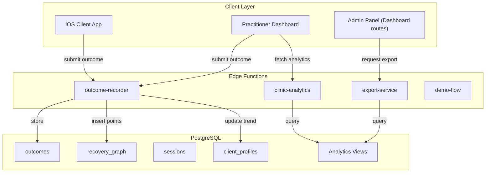
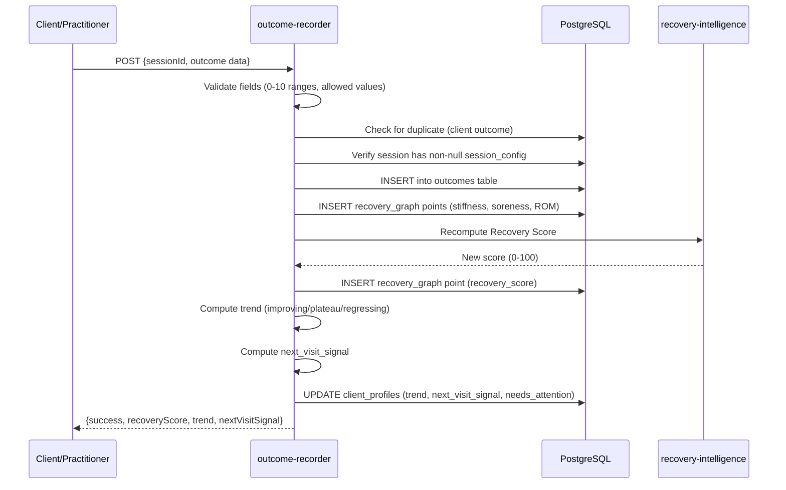

# Design Document — Outcomes, Analytics & Integration

## Overview

This design covers the Post-Session Outcomes & Learning Loop (Phase 7), Analytics, Admin & Clinic Intelligence (Phase 8), and Final Integration, Polish & Demo Prep (Phase 9) for HydraScan. It is Spec 4 of 4, owned by Geo on the `geo-dev` branch.

The system closes the Know → Act → Learn flywheel by capturing outcomes, feeding them back into the Recovery Graph and Recovery Score, analyzing trends, surfacing clinic-wide analytics, providing admin tools, and integrating end-to-end with a demo flow.

### Key Design Decisions

1. **Outcome recording as an Edge Function** — The `outcome-recorder` Edge Function handles validation, storage, Recovery Graph updates, Recovery Score recomputation, trend analysis, and next-visit signal generation in a single server-side transaction.
2. **Trend analysis computed on-write** — When an outcome is recorded, trend classification and next-visit signal are computed and stored immediately, avoiding expensive aggregation on dashboard load.
3. **Analytics via database views + Edge Function** — Aggregate metrics use PostgreSQL views with RLS for automatic clinic scoping. Complex analytics use a `clinic-analytics` Edge Function.
4. **Export as Edge Function** — CSV/PDF generation via `export-service` Edge Function with RLS scoping.
5. **Admin Panel as dashboard routes** — Admin functionality is additional routes in the Practitioner Dashboard, gated by role.
6. **Wellness language audit as build-time check** — A script scans all user-facing strings against `validateWellnessLanguage`.

## Architecture

### High-Level Component Diagram



### Outcome Recording Flow



## Components and Interfaces

### Project Structure (additions to monorepo)

```
hydrascan/
├── backend/supabase/
│   ├── functions/
│   │   ├── outcome-recorder/index.ts
│   │   ├── clinic-analytics/index.ts
│   │   ├── export-service/index.ts
│   │   └── demo-flow/index.ts
│   ├── migrations/
│   │   ├── 00013_create_analytics_views.sql
│   │   ├── 00014_create_performance_indexes.sql
│   │   └── 00015_add_trend_columns.sql
│   └── seed/
│       └── demo-personas.sql
│
├── dashboard/src/
│   ├── app/
│   │   ├── analytics/page.tsx
│   │   ├── admin/
│   │   │   ├── settings/page.tsx
│   │   │   ├── users/page.tsx
│   │   │   └── devices/page.tsx
│   │   └── demo/page.tsx
│   ├── components/
│   │   ├── analytics/
│   │   │   ├── AggregateMetrics.tsx
│   │   │   ├── PractitionerPerformance.tsx
│   │   │   ├── ProtocolEffectiveness.tsx
│   │   │   ├── DeviceUtilization.tsx
│   │   │   ├── ClientRetention.tsx
│   │   │   └── ROICalculator.tsx
│   │   ├── admin/
│   │   │   ├── ClinicSettings.tsx
│   │   │   ├── UserManagement.tsx
│   │   │   └── DeviceManagement.tsx
│   │   └── shared/
│   │       ├── LoadingIndicator.tsx
│   │       ├── ErrorMessage.tsx
│   │       ├── EmptyState.tsx
│   │       └── SimulationBadge.tsx
│   └── hooks/
│       ├── useAnalytics.ts
│       ├── useExport.ts
│       └── useROI.ts
│
└── scripts/
    └── wellness-audit.ts
```

### Edge Function Interfaces

#### outcome-recorder

```typescript
// POST /functions/v1/outcome-recorder
interface OutcomeRequest {
  session_id: string;
  recorded_by: 'client' | 'practitioner';
  stiffness_before?: number;    // 0-10, practitioner only
  stiffness_after: number;      // 0-10
  soreness_after?: number;      // 0-10, client only
  mobility_improved: boolean | null;
  session_effective: boolean | null;
  repeat_intent: 'yes' | 'maybe' | 'no';
  rom_after?: Record<string, number>;
  notes?: string;
}

interface OutcomeResponse {
  success: boolean;
  outcomeId: string;
  recoveryScore: number;
  trend: 'improving' | 'plateau' | 'regressing' | 'insufficient_data';
  nextVisitSignal: NextVisitSignal;
  error?: string;
}

interface NextVisitSignal {
  recommended_return_days: number;
  urgency: 'routine' | 'soon' | 'priority';
  rationale: string;
}
```

#### clinic-analytics

```typescript
// POST /functions/v1/clinic-analytics
interface AnalyticsRequest {
  action: 'aggregate' | 'practitioner' | 'protocol' | 'device' | 'retention' | 'roi';
  date_range?: { start: string; end: string };  // Default: last 30 days
  per_session_revenue?: number;                   // Default: 15
  monthly_subscription_cost?: number;             // For ROI calculation
}

interface AggregateMetrics {
  totalSessions: number;
  avgRecoveryScoreImprovement: number;
  deviceUtilization: DeviceUtilizationMetric[];
  clientRetention: ClientRetentionMetric;
  activeClients: number;
}

interface PractitionerMetric {
  practitionerId: string;
  displayName: string;          // First name or initials only
  totalSessions: number;
  avgSessionsPerDay: number;
  avgOutcomeScore: number;
  clientCount: number;
}

interface ProtocolEffectivenessMetric {
  recoveryGoal: string;
  bodyRegion: string;
  avgOutcomeScore: number;
  sessionCount: number;
  limitedData: boolean;         // true if < 5 sessions
}

interface ROIMetrics {
  totalEstimatedRevenue: number;
  avgRevenuePerClient: number;
  estimatedClientLifetimeValue: number;
  paybackPeriodDays: number;
  conversionRate: number;       // % returning for 2nd session
}
```

#### export-service

```typescript
// POST /functions/v1/export-service
interface ExportRequest {
  format: 'csv' | 'pdf';
  date_range?: { start: string; end: string };
}

interface ExportResponse {
  success: boolean;
  downloadUrl: string;          // Supabase Storage signed URL
  format: string;
  generatedAt: string;
}
```

### Database Migrations

#### Analytics Views (00013)

```sql
-- Clinic aggregate metrics view
CREATE VIEW clinic_metrics_v AS
SELECT
  s.clinic_id,
  COUNT(s.id) as total_sessions,
  COUNT(DISTINCT s.client_id) as unique_clients,
  AVG(CASE WHEN o.stiffness_before IS NOT NULL AND o.stiffness_after IS NOT NULL
      THEN (o.stiffness_before - o.stiffness_after)::numeric / 10 END) as avg_improvement
FROM sessions s
LEFT JOIN outcomes o ON o.session_id = s.id
WHERE s.status = 'completed'
GROUP BY s.clinic_id;

-- Per-practitioner metrics view
CREATE VIEW practitioner_metrics_v AS
SELECT
  s.clinic_id,
  s.practitioner_id,
  u.full_name as practitioner_name,
  COUNT(s.id) as total_sessions,
  COUNT(DISTINCT s.client_id) as client_count,
  AVG(CASE WHEN o.stiffness_before IS NOT NULL AND o.stiffness_after IS NOT NULL
      THEN (o.stiffness_before - o.stiffness_after)::numeric / 10 END) as avg_outcome_score
FROM sessions s
JOIN users u ON u.id = s.practitioner_id
LEFT JOIN outcomes o ON o.session_id = s.id AND o.recorded_by = 'practitioner'
WHERE s.status = 'completed'
GROUP BY s.clinic_id, s.practitioner_id, u.full_name;

-- Device utilization view
CREATE VIEW device_utilization_v AS
SELECT
  d.clinic_id,
  d.id as device_id,
  d.label,
  d.room,
  d.status as current_status,
  COUNT(s.id) as session_count,
  COUNT(CASE WHEN d.status = 'maintenance' THEN 1 END) as maintenance_count
FROM devices d
LEFT JOIN sessions s ON s.device_id = d.id AND s.status = 'completed'
GROUP BY d.clinic_id, d.id, d.label, d.room, d.status;

-- Protocol effectiveness view
CREATE VIEW protocol_effectiveness_v AS
SELECT
  s.clinic_id,
  s.session_config->>'recoveryGoal' as recovery_goal,
  s.session_config->>'bodyRegion' as body_region,
  COUNT(s.id) as session_count,
  AVG(CASE WHEN o.stiffness_before IS NOT NULL AND o.stiffness_after IS NOT NULL
      THEN (o.stiffness_before - o.stiffness_after)::numeric / 10 END) as avg_outcome_score
FROM sessions s
LEFT JOIN outcomes o ON o.session_id = s.id
WHERE s.status = 'completed'
GROUP BY s.clinic_id, s.session_config->>'recoveryGoal', s.session_config->>'bodyRegion';
```

#### Performance Indexes (00014)

```sql
CREATE INDEX IF NOT EXISTS idx_outcomes_session_recorded
  ON outcomes(session_id, recorded_by);

CREATE INDEX IF NOT EXISTS idx_recovery_graph_client_region_time
  ON recovery_graph(client_id, body_region, recorded_at DESC);

CREATE INDEX IF NOT EXISTS idx_sessions_clinic_status
  ON sessions(clinic_id, status);

CREATE INDEX IF NOT EXISTS idx_sessions_practitioner
  ON sessions(practitioner_id, status);
```

#### Trend Columns (00015)

```sql
ALTER TABLE client_profiles
  ADD COLUMN IF NOT EXISTS trend_classification TEXT DEFAULT 'insufficient_data',
  ADD COLUMN IF NOT EXISTS needs_attention BOOLEAN DEFAULT false,
  ADD COLUMN IF NOT EXISTS next_visit_signal JSONB;
```

### Trend Analysis Logic

```typescript
function computeTrend(
  recentOutcomes: Outcome[]  // Last 3 sessions, ordered by date desc
): 'improving' | 'plateau' | 'regressing' | 'insufficient_data' {
  if (recentOutcomes.length < 3) return 'insufficient_data';

  const stiffnessValues = recentOutcomes
    .filter(o => o.stiffness_after != null)
    .map(o => o.stiffness_after!);

  if (stiffnessValues.length < 3) return 'insufficient_data';

  // Check if stiffness is decreasing (improving)
  const [latest, mid, oldest] = stiffnessValues;
  const totalChange = oldest - latest;
  const absChange = Math.abs(totalChange);

  if (absChange <= 1) return 'plateau';
  if (totalChange > 0) return 'improving';  // stiffness decreased
  return 'regressing';  // stiffness increased
}

function computeNextVisitSignal(
  recoveryScore: number,
  trend: string
): NextVisitSignal {
  if (recoveryScore < 40 && trend === 'regressing') {
    return { recommended_return_days: 2, urgency: 'priority',
      rationale: 'Recovery Score below 40 with regressing trend — early return recommended.' };
  }
  if (recoveryScore <= 70 && trend === 'plateau') {
    return { recommended_return_days: 4, urgency: 'soon',
      rationale: 'Recovery Score plateauing — a follow-up session may help break through.' };
  }
  return { recommended_return_days: 10, urgency: 'routine',
    rationale: 'Recovery trajectory is positive — routine follow-up recommended.' };
}
```

### ROI Calculator Logic

```typescript
function computeROI(input: {
  totalSessions: number;
  uniqueClients: number;
  returningClients: number;
  perSessionRevenue: number;
  monthlySubscriptionCost: number;
  avgRetentionMonths: number;
}): ROIMetrics {
  const totalRevenue = input.totalSessions * input.perSessionRevenue;
  const avgRevenuePerClient = input.uniqueClients > 0
    ? totalRevenue / input.uniqueClients : 0;
  const ltv = avgRevenuePerClient * input.avgRetentionMonths;
  const dailyRevenue = totalRevenue / 30;
  const paybackDays = dailyRevenue > 0
    ? Math.ceil(input.monthlySubscriptionCost / dailyRevenue) : 999;
  const conversionRate = input.uniqueClients > 0
    ? (input.returningClients / input.uniqueClients) * 100 : 0;

  return { totalEstimatedRevenue: totalRevenue, avgRevenuePerClient,
    estimatedClientLifetimeValue: ltv, paybackPeriodDays: paybackDays,
    conversionRate };
}
```

### Demo Seed Data

Three client personas with 3-5 sessions each:

| Persona | Sessions | Recovery Score Trend | Body Region |
|---------|----------|---------------------|-------------|
| Alex Rivera | 5 | 35 → 52 → 61 → 68 → 74 (improving) | right_shoulder |
| Jordan Chen | 3 | 45 → 47 → 46 (plateau) | lower_back |
| Sam Patel | 4 | 60 → 55 → 48 → 42 (regressing) | left_knee |

### Wellness Language Audit Script

```typescript
// scripts/wellness-audit.ts
import { validateWellnessLanguage } from '@hydrascan/shared';
import { glob } from 'glob';
import { readFile } from 'fs/promises';

const UI_FILE_PATTERNS = [
  'dashboard/src/**/*.tsx',
  'ios/HydraScan/Views/**/*.swift',
  'backend/supabase/seed/**/*.sql',
];

// Extract string literals and check against forbidden terms
// Exit with code 1 if any violations found
```

## Correctness Properties

### Property 1: Outcome validation bounds
For any outcome submission, stiffness_before, stiffness_after, and soreness_after values must be integers in [0, 10]. Values outside this range must be rejected.
**Validates: Requirements 1.3, 2.3**

### Property 2: Duplicate client outcome rejection
For any session that already has a client-recorded outcome, a second client outcome submission must be rejected. Practitioner outcomes are not subject to this constraint.
**Validates: Requirements 2.4**

### Property 3: Recovery Graph point insertion on outcome
For any outcome with stiffness_after, a recovery_graph point with metric_type "stiffness" must be inserted. For any outcome with rom_after values, one recovery_graph point per ROM measurement must be inserted.
**Validates: Requirements 4.1, 4.2, 4.3**

### Property 4: Recovery Score clamping
For any combination of outcome trend, check-in trend, wearable context, and adherence values, the computed Recovery Score must be in [0, 100].
**Validates: Requirements 5.3**

### Property 5: Trend classification correctness
For any sequence of 3+ outcomes with stiffness values, if stiffness decreased by more than 1 point total, trend must be "improving". If stiffness increased by more than 1 point, trend must be "regressing". If change is ≤1, trend must be "plateau". For fewer than 3 outcomes, trend must be "insufficient_data".
**Validates: Requirements 6.1, 6.2**

### Property 6: Next-visit signal urgency mapping
For any (recoveryScore, trend) pair: score < 40 + regressing → "priority"; score 40-70 + plateau → "soon"; score > 70 + improving → "routine".
**Validates: Requirements 7.2, 7.3, 7.4**

### Property 7: RLS isolation in analytics
For any two admins in different clinics, analytics queries by Admin A must never return data from Admin B's clinic.
**Validates: Requirements 21.1, 21.2, 21.3, 21.4**

### Property 8: Protocol effectiveness limited data threshold
For any protocol configuration with fewer than 5 sessions, it must be marked as "limited data" and excluded from ranking.
**Validates: Requirements 10.4**

### Property 9: ROI computation consistency
For any set of inputs, totalEstimatedRevenue must equal totalSessions × perSessionRevenue, and conversionRate must equal (returningClients / uniqueClients) × 100.
**Validates: Requirements 13.2, 13.4**

### Property 10: Export data scoping
For any export request, all data in the generated file must belong to the requesting admin's clinic_id.
**Validates: Requirements 12.3**

## Error Handling

| Scenario | HTTP Status | Behavior |
|----------|-------------|----------|
| Invalid outcome values (out of range) | 400 | Return validation errors |
| Duplicate client outcome | 409 | Return descriptive error |
| Session not found or no session_config | 404 | Return error |
| Unauthenticated request | 401 | Return error |
| Cross-clinic access attempt | 403 | Return error |
| Export generation timeout (>10s) | 504 | Return timeout error |
| Analytics query failure | 500 | Return generic error, log details |
