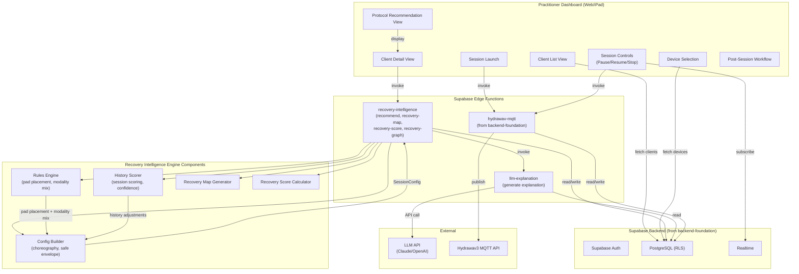
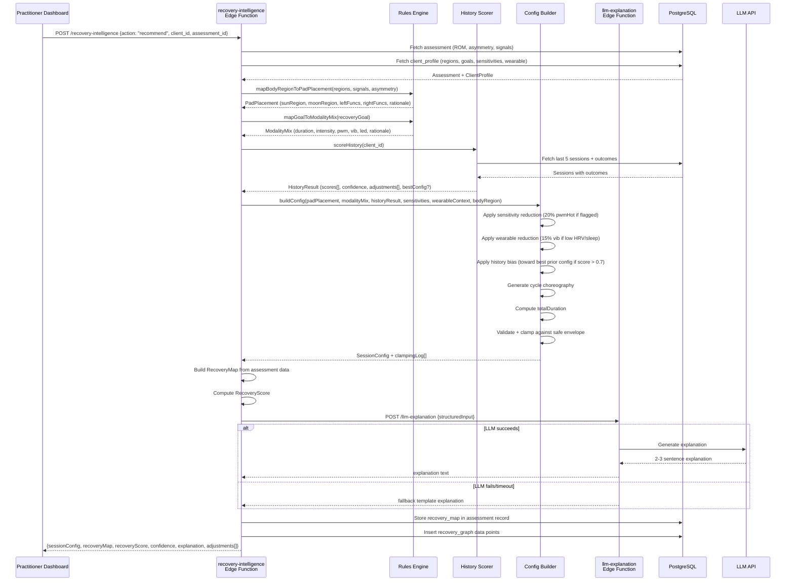
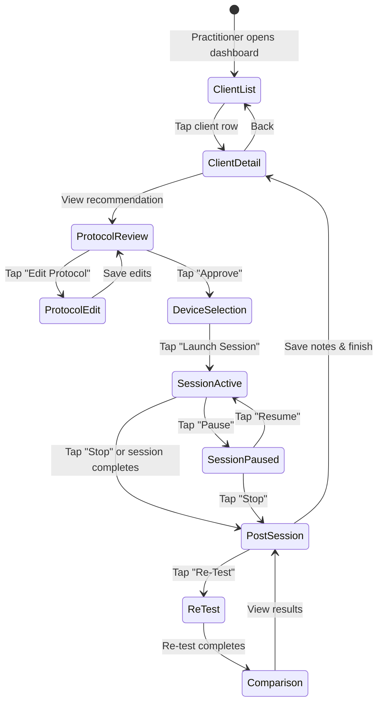
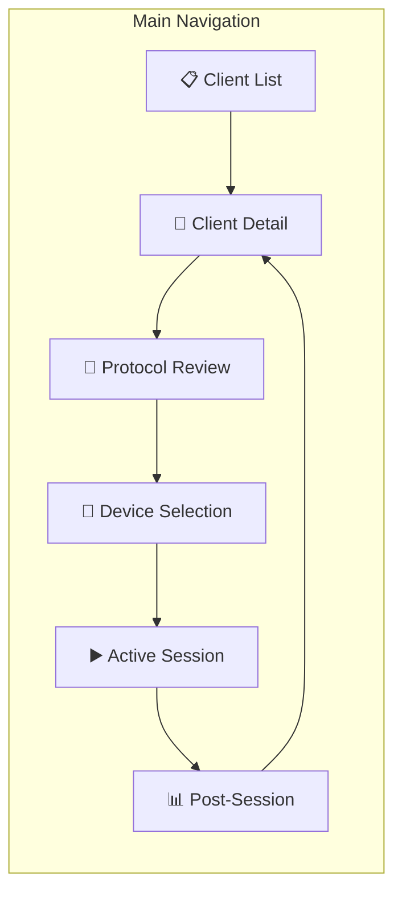

# Design Document — Recovery Intelligence Dashboard

## Overview

This design covers the Recovery Intelligence Engine (Phase 4) and Practitioner Dashboard & Session Workflow (Phase 5) for HydraScan. The Recovery Intelligence Engine is a set of Supabase Edge Functions (TypeScript/Deno) that consume assessment data from the iOS Assessment Pipeline (Spec 2), client profiles, and session history to produce personalized SessionConfig recommendations with plain-language explanations. The Practitioner Dashboard is a web/iPad application (React/Next.js or similar) that provides the practitioner-facing UI for client management, protocol review, device selection, session launch, real-time session control, and post-session workflows.

This is Spec 3 of 4, owned by Sri on the `sri-dev` branch. It depends on:
- **backend-foundation** (Spec 1): Auth, database schema, RLS policies, device registry, MQTT proxy, SessionConfig types, safe envelope validation
- **ios-assessment-pipeline** (Spec 2): QuickPoseResult data, Assessment records, client intake flow

### Key Design Decisions

1. **Deterministic Rules Engine, LLM for explanation only** — The Rules_Engine makes all protocol decisions (pad placement, modality mix, intensity calibration). The LLM generates a plain-language explanation of the decision already made. This ensures reproducibility, testability, and safety — the LLM cannot override safe envelope constraints or prescribe unsafe parameters.

2. **Three-component pipeline architecture** — The recommendation flow is split into Rules_Engine → History_Scorer → Config_Builder. Each component is a pure function (or near-pure with DB reads for History_Scorer) that can be tested independently. The Config_Builder applies safe envelope clamping as the final step before output.

3. **Single Edge Function with sub-routes** — Rather than separate Edge Functions per capability, the Recovery Intelligence Engine is a single `recovery-intelligence` Edge Function with action-based routing (`recommend`, `recovery-map`, `recovery-score`, `recovery-graph`). This reduces cold start overhead and shares initialization code.

4. **Recovery Score as a derived metric** — The Recovery Score is recomputed on every outcome or check-in event, not stored as a mutable field on the client profile. The latest value is always the most recent `recovery_score` entry in the `recovery_graph` table. This provides full audit trail and avoids stale data.

5. **Pre-loading for two-minute workflow** — The Practitioner Dashboard pre-fetches the recommendation, device list, and Recovery Map when the client list loads, so that navigating to a client detail view is instant. This meets the two-minute interaction constraint for high-volume clinics.

6. **Fallback template for LLM failures** — If the LLM API call fails or times out (3-second timeout), a template-based fallback generates the explanation from structured data. The recommendation workflow never blocks on LLM availability.

7. **Supabase Realtime for session status** — The dashboard subscribes to Supabase Realtime on the `devices` table for live session status updates. This avoids polling and provides sub-2-second status change visibility.

## Architecture

### High-Level System Architecture



### Recommendation Request Flow



### Session Lifecycle Flow



### Dashboard Screen Navigation



## Components and Interfaces

### 1. Project Structure (additions to monorepo)

```
hydrascan/
├── backend/
│   └── supabase/
│       └── functions/
│           ├── recovery-intelligence/
│           │   ├── index.ts                    # Edge Function entry point (action router)
│           │   ├── rules-engine.ts             # Body region → pad placement, goal → modality mix
│           │   ├── history-scorer.ts           # Session history scoring + confidence
│           │   ├── config-builder.ts           # SessionConfig assembly + safe envelope
│           │   ├── recovery-map.ts             # Recovery Map generation
│           │   ├── recovery-score.ts           # Recovery Score computation
│           │   └── recovery-graph.ts           # Recovery Graph data insertion/query
│           ├── llm-explanation/
│           │   ├── index.ts                    # Edge Function entry point
│           │   ├── prompt-builder.ts           # Structured input → LLM prompt
│           │   └── fallback-template.ts        # Template-based fallback explanation
│           └── _shared/
│               ├── cors.ts                     # (from backend-foundation)
│               ├── supabase-client.ts          # (from backend-foundation)
│               └── safe-envelope.ts            # (from backend-foundation)
│
├── shared/
│   └── src/
│       ├── types/
│       │   ├── recovery-intelligence.ts        # RulesEngine, HistoryScorer, ConfigBuilder types
│       │   ├── recovery-map.ts                 # RecoveryMap, HighlightedRegion types
│       │   ├── recovery-score.ts               # RecoveryScore computation types
│       │   └── llm-explanation.ts              # LLM input/output types
│       └── constants/
│           ├── pad-placement-map.ts            # BodyRegion → PadPlacement lookup table
│           ├── modality-mix-map.ts             # RecoveryGoal → ModalityMix lookup table
│           ├── adjacent-regions.ts             # BodyRegion adjacency graph
│           └── bilateral-pairs.ts              # Bilateral joint pair definitions
│
└── dashboard/                                  # Practitioner Dashboard app
    ├── package.json
    ├── tsconfig.json
    ├── src/
    │   ├── app/                                # Next.js app router pages
    │   │   ├── layout.tsx
    │   │   ├── page.tsx                        # Redirect to /clients
    │   │   ├── clients/
    │   │   │   ├── page.tsx                    # Client List View
    │   │   │   └── [clientId]/
    │   │   │       ├── page.tsx                # Client Detail View
    │   │   │       ├── protocol/page.tsx       # Protocol Recommendation View
    │   │   │       ├── session/page.tsx        # Active Session View
    │   │   │       └── post-session/page.tsx   # Post-Session Workflow
    │   │   └── devices/
    │   │       └── page.tsx                    # Device Selection (modal or page)
    │   ├── components/
    │   │   ├── client-list/
    │   │   │   ├── ClientListTable.tsx
    │   │   │   ├── ClientRow.tsx
    │   │   │   └── SortControls.tsx
    │   │   ├── client-detail/
    │   │   │   ├── RecoveryMapDisplay.tsx
    │   │   │   ├── BodyAvatar.tsx
    │   │   │   ├── RecoveryGraphChart.tsx
    │   │   │   ├── SessionHistoryList.tsx
    │   │   │   └── WearableContextCard.tsx
    │   │   ├── protocol/
    │   │   │   ├── ProtocolCard.tsx
    │   │   │   ├── ProtocolEditor.tsx
    │   │   │   ├── ConstrainedSlider.tsx
    │   │   │   ├── ExplanationCard.tsx
    │   │   │   └── ConfidenceBadge.tsx
    │   │   ├── session/
    │   │   │   ├── SessionStatusDisplay.tsx
    │   │   │   ├── LifecycleControls.tsx
    │   │   │   ├── ElapsedTimer.tsx
    │   │   │   └── SimulationBadge.tsx
    │   │   ├── device/
    │   │   │   ├── DeviceList.tsx
    │   │   │   └── DeviceCard.tsx
    │   │   └── post-session/
    │   │       ├── RetestComparison.tsx
    │   │       ├── RomDeltaTable.tsx
    │   │       └── SessionNotesEditor.tsx
    │   ├── hooks/
    │   │   ├── useSupabase.ts
    │   │   ├── useRealtimeDevice.ts
    │   │   ├── useRecommendation.ts
    │   │   ├── useRecoveryMap.ts
    │   │   ├── useRecoveryGraph.ts
    │   │   ├── useRecoveryScore.ts
    │   │   ├── useDevices.ts
    │   │   └── useSessionLifecycle.ts
    │   ├── lib/
    │   │   ├── supabase-client.ts
    │   │   ├── edge-functions.ts               # Typed wrappers for Edge Function calls
    │   │   └── formatters.ts                   # Display formatting utilities
    │   └── types/
    │       └── index.ts                        # Re-exports from @hydrascan/shared
    └── tests/
        ├── rules-engine.test.ts
        ├── history-scorer.test.ts
        ├── config-builder.test.ts
        ├── recovery-score.test.ts
        ├── recovery-map.test.ts
        └── session-config-roundtrip.test.ts
```

### 2. Edge Function Interfaces

#### recovery-intelligence (Action Router)

**Purpose:** Single Edge Function handling all Recovery Intelligence Engine operations via action-based routing.

```typescript
// POST /functions/v1/recovery-intelligence
// Headers: Authorization: Bearer <supabase_jwt>

// --- Action: recommend ---
interface RecommendRequest {
  action: 'recommend';
  client_id: string;       // UUID
  assessment_id: string;   // UUID
}

interface RecommendResponse {
  sessionConfig: SessionConfig;
  recoveryMap: RecoveryMap;
  recoveryScore: number;
  confidence: number;          // 0.0–1.0
  explanation: string;         // LLM-generated or fallback
  adjustments: string[];       // Plain-text History_Scorer adjustment descriptions
  clampingLog: ClampingEntry[];
}

// --- Action: recovery-map ---
interface RecoveryMapRequest {
  action: 'recovery-map';
  client_id: string;
  assessment_id: string;
}

interface RecoveryMapResponse {
  recoveryMap: RecoveryMap;
}

// --- Action: recovery-score ---
interface RecoveryScoreRequest {
  action: 'recovery-score';
  client_id: string;
}

interface RecoveryScoreResponse {
  score: number;               // 0–100
  computedAt: string;          // ISO timestamp
}

// --- Action: recovery-graph ---
interface RecoveryGraphRequest {
  action: 'recovery-graph';
  client_id: string;
  body_region: BodyRegion;
  limit?: number;              // Default 30
}

interface RecoveryGraphResponse {
  dataPoints: RecoveryGraphPoint[];
}
```

#### llm-explanation

**Purpose:** Generate plain-language explanations for protocol recommendations using an LLM, with fallback to template-based generation.

```typescript
// POST /functions/v1/llm-explanation
// Headers: Authorization: Bearer <supabase_jwt>

interface LlmExplanationRequest {
  targetRegion: BodyRegion;
  recoveryGoal: RecoveryGoal;
  romValues: Record<string, number>;
  asymmetryScores: Record<string, number>;
  priorSessionCount: number;
  bestPriorOutcomeScore: number;
  confidencePercent: number;
  sessionDuration: number;
  thermalPwmHot: [number, number, number];
  thermalPwmCold: [number, number, number];
  vibMin: number;
  vibMax: number;
  ledStatus: 0 | 1;
  clientName: string;
  targetRegions: BodyRegion[];
  wearableContext?: {
    hrv: number;
    strain: number;
    sleepScore: number;
  };
}

interface LlmExplanationResponse {
  explanation: string;
  isFallback: boolean;
}
```

### 3. Rules Engine

#### Pad Placement Mapping

The Rules Engine maintains a static lookup table mapping each `BodyRegion` to a `PadPlacement`. The Sun pad (warming, red) targets the primary region for thermal modulation, while the Moon pad (cooling, blue) targets an adjacent or complementary region.

```typescript
// shared/src/types/recovery-intelligence.ts

interface PadPlacement {
  sunRegion: string;           // Warming pad location description
  moonRegion: string;          // Cooling pad location description
  leftFuncs: ModalityFunc[];   // Left pad modality sequence
  rightFuncs: ModalityFunc[];  // Right pad modality sequence
  rationale: string;           // Plain-text explanation
}

interface ModalityMix {
  edgeCycleDuration: number;   // Minutes (7 or 9)
  intensityProfile: 'gentle' | 'moderate' | 'intense';
  pwmHot: [number, number, number];
  pwmCold: [number, number, number];
  vibMin: number;
  vibMax: number;
  led: 0 | 1;
  rationale: string;
}

// Pad placement lookup table (15 entries)
// shared/src/constants/pad-placement-map.ts
const PAD_PLACEMENT_MAP: Record<BodyRegion, PadPlacement> = {
  right_shoulder: {
    sunRegion: 'Right anterior deltoid / upper trapezius',
    moonRegion: 'Right posterior deltoid / infraspinatus',
    leftFuncs: ['leftHotRed', 'leftColdBlue', 'leftHotRed'],
    rightFuncs: ['rightColdBlue', 'rightHotRed', 'rightColdBlue'],
    rationale: 'Sun pad warms the anterior shoulder to promote circulation; Moon pad cools the posterior shoulder to support recovery.',
  },
  left_shoulder: {
    sunRegion: 'Left anterior deltoid / upper trapezius',
    moonRegion: 'Left posterior deltoid / infraspinatus',
    leftFuncs: ['leftColdBlue', 'leftHotRed', 'leftColdBlue'],
    rightFuncs: ['rightHotRed', 'rightColdBlue', 'rightHotRed'],
    rationale: 'Sun pad warms the anterior shoulder to promote circulation; Moon pad cools the posterior shoulder to support recovery.',
  },
  neck: {
    sunRegion: 'Posterior cervical / upper trapezius',
    moonRegion: 'Lateral cervical / levator scapulae',
    leftFuncs: ['leftHotRed', 'leftColdBlue', 'leftHotRed'],
    rightFuncs: ['rightColdBlue', 'rightHotRed', 'rightColdBlue'],
    rationale: 'Gentle warming on posterior neck supports tension release; cooling on lateral neck supports comfort. Region-specific safe limits applied.',
  },
  lower_back: {
    sunRegion: 'Lumbar paraspinals (L3–L5)',
    moonRegion: 'Sacroiliac region',
    leftFuncs: ['leftHotRed', 'leftColdBlue', 'leftHotRed'],
    rightFuncs: ['rightColdBlue', 'rightHotRed', 'rightColdBlue'],
    rationale: 'Sun pad warms lumbar paraspinals to support mobility; Moon pad cools sacroiliac region. Region-specific safe limits applied.',
  },
  upper_back: {
    sunRegion: 'Thoracic paraspinals (T4–T8)',
    moonRegion: 'Rhomboid / mid-trapezius',
    leftFuncs: ['leftHotRed', 'leftColdBlue', 'leftHotRed'],
    rightFuncs: ['rightColdBlue', 'rightHotRed', 'rightColdBlue'],
    rationale: 'Sun pad warms thoracic spine to support posture recovery; Moon pad cools rhomboid area.',
  },
  right_hip: {
    sunRegion: 'Right hip flexor / TFL',
    moonRegion: 'Right gluteus medius',
    leftFuncs: ['leftHotRed', 'leftColdBlue', 'leftHotRed'],
    rightFuncs: ['rightColdBlue', 'rightHotRed', 'rightColdBlue'],
    rationale: 'Sun pad warms hip flexor to support mobility; Moon pad cools gluteus medius for recovery balance.',
  },
  left_hip: {
    sunRegion: 'Left hip flexor / TFL',
    moonRegion: 'Left gluteus medius',
    leftFuncs: ['leftColdBlue', 'leftHotRed', 'leftColdBlue'],
    rightFuncs: ['rightHotRed', 'rightColdBlue', 'rightHotRed'],
    rationale: 'Sun pad warms hip flexor to support mobility; Moon pad cools gluteus medius for recovery balance.',
  },
  right_knee: {
    sunRegion: 'Right quadriceps / VMO',
    moonRegion: 'Right popliteal / hamstring insertion',
    leftFuncs: ['leftHotRed', 'leftColdBlue', 'leftHotRed'],
    rightFuncs: ['rightColdBlue', 'rightHotRed', 'rightColdBlue'],
    rationale: 'Sun pad warms quadriceps to support knee mobility; Moon pad cools posterior knee.',
  },
  left_knee: {
    sunRegion: 'Left quadriceps / VMO',
    moonRegion: 'Left popliteal / hamstring insertion',
    leftFuncs: ['leftColdBlue', 'leftHotRed', 'leftColdBlue'],
    rightFuncs: ['rightHotRed', 'rightColdBlue', 'rightHotRed'],
    rationale: 'Sun pad warms quadriceps to support knee mobility; Moon pad cools posterior knee.',
  },
  right_calf: {
    sunRegion: 'Right gastrocnemius',
    moonRegion: 'Right soleus / Achilles region',
    leftFuncs: ['leftHotRed', 'leftColdBlue', 'leftHotRed'],
    rightFuncs: ['rightColdBlue', 'rightHotRed', 'rightColdBlue'],
    rationale: 'Sun pad warms gastrocnemius for circulation; Moon pad cools lower calf.',
  },
  left_calf: {
    sunRegion: 'Left gastrocnemius',
    moonRegion: 'Left soleus / Achilles region',
    leftFuncs: ['leftColdBlue', 'leftHotRed', 'leftColdBlue'],
    rightFuncs: ['rightHotRed', 'rightColdBlue', 'rightHotRed'],
    rationale: 'Sun pad warms gastrocnemius for circulation; Moon pad cools lower calf.',
  },
  right_arm: {
    sunRegion: 'Right biceps / anterior forearm',
    moonRegion: 'Right triceps / posterior forearm',
    leftFuncs: ['leftHotRed', 'leftColdBlue', 'leftHotRed'],
    rightFuncs: ['rightColdBlue', 'rightHotRed', 'rightColdBlue'],
    rationale: 'Sun pad warms anterior arm; Moon pad cools posterior arm for balanced recovery.',
  },
  left_arm: {
    sunRegion: 'Left biceps / anterior forearm',
    moonRegion: 'Left triceps / posterior forearm',
    leftFuncs: ['leftColdBlue', 'leftHotRed', 'leftColdBlue'],
    rightFuncs: ['rightHotRed', 'rightColdBlue', 'rightHotRed'],
    rationale: 'Sun pad warms anterior arm; Moon pad cools posterior arm for balanced recovery.',
  },
  right_foot: {
    sunRegion: 'Right plantar fascia / arch',
    moonRegion: 'Right dorsal foot / ankle',
    leftFuncs: ['leftHotRed', 'leftColdBlue', 'leftHotRed'],
    rightFuncs: ['rightColdBlue', 'rightHotRed', 'rightColdBlue'],
    rationale: 'Sun pad warms plantar surface; Moon pad cools dorsal foot.',
  },
  left_foot: {
    sunRegion: 'Left plantar fascia / arch',
    moonRegion: 'Left dorsal foot / ankle',
    leftFuncs: ['leftColdBlue', 'leftHotRed', 'leftColdBlue'],
    rightFuncs: ['rightHotRed', 'rightColdBlue', 'rightHotRed'],
    rationale: 'Sun pad warms plantar surface; Moon pad cools dorsal foot.',
  },
};
```

#### Adjacent Region Graph (for compensation hints)

```typescript
// shared/src/constants/adjacent-regions.ts

const ADJACENT_REGIONS: Record<BodyRegion, BodyRegion[]> = {
  right_shoulder: ['neck', 'upper_back', 'right_arm'],
  left_shoulder: ['neck', 'upper_back', 'left_arm'],
  neck: ['right_shoulder', 'left_shoulder', 'upper_back'],
  upper_back: ['neck', 'right_shoulder', 'left_shoulder', 'lower_back'],
  lower_back: ['upper_back', 'right_hip', 'left_hip'],
  right_hip: ['lower_back', 'right_knee'],
  left_hip: ['lower_back', 'left_knee'],
  right_knee: ['right_hip', 'right_calf'],
  left_knee: ['left_hip', 'left_calf'],
  right_calf: ['right_knee', 'right_foot'],
  left_calf: ['left_knee', 'left_foot'],
  right_arm: ['right_shoulder'],
  left_arm: ['left_shoulder'],
  right_foot: ['right_calf'],
  left_foot: ['left_calf'],
};
```

#### Rules Engine Functions

```typescript
// backend/supabase/functions/recovery-intelligence/rules-engine.ts

/**
 * Select the primary body region from highlighted regions based on highest severity.
 * When severities are equal, the first region in the array wins (stable sort).
 */
function selectPrimaryRegion(
  highlightedRegions: Array<{ region: BodyRegion; severity: number }>
): BodyRegion;

/**
 * Map a BodyRegion to its PadPlacement, optionally appending a compensation hint
 * if any adjacent region has asymmetry > 10%.
 */
function mapBodyRegionToPadPlacement(
  primaryRegion: BodyRegion,
  asymmetryScores: Record<string, number>,
  recoverySignals: Array<{ region: BodyRegion; type: string; severity: number }>
): PadPlacement;

/**
 * Map a RecoveryGoal to its ModalityMix configuration.
 */
function mapGoalToModalityMix(goal: RecoveryGoal): ModalityMix;
```

#### Modality Mix Lookup Table

```typescript
// shared/src/constants/modality-mix-map.ts

const MODALITY_MIX_MAP: Record<RecoveryGoal, ModalityMix> = {
  mobility: {
    edgeCycleDuration: 9,
    intensityProfile: 'moderate',
    pwmHot: [80, 100, 120],
    pwmCold: [150, 180, 200],
    vibMin: 25,
    vibMax: 180,
    led: 1,
    rationale: 'Moderate thermal contrast with vibro-acoustic stimulation supports joint mobility and tissue flexibility.',
  },
  warm_up: {
    edgeCycleDuration: 7,
    intensityProfile: 'gentle',
    pwmHot: [60, 80, 100],
    pwmCold: [120, 140, 160],
    vibMin: 15,
    vibMax: 140,
    led: 1,
    rationale: 'Gentle warming with light vibration prepares tissues for activity without overstimulation.',
  },
  recovery: {
    edgeCycleDuration: 9,
    intensityProfile: 'moderate',
    pwmHot: [90, 110, 130],
    pwmCold: [160, 190, 220],
    vibMin: 20,
    vibMax: 160,
    led: 1,
    rationale: 'Moderate thermal contrast with photobiomodulation supports post-activity recovery and circulation.',
  },
  relaxation: {
    edgeCycleDuration: 9,
    intensityProfile: 'gentle',
    pwmHot: [50, 70, 90],
    pwmCold: [130, 150, 170],
    vibMin: 10,
    vibMax: 120,
    led: 1,
    rationale: 'Gentle warming with low vibration promotes deep relaxation and stress reduction.',
  },
  performance_prep: {
    edgeCycleDuration: 7,
    intensityProfile: 'intense',
    pwmHot: [100, 120, 140],
    pwmCold: [170, 200, 230],
    vibMin: 30,
    vibMax: 200,
    led: 1,
    rationale: 'Intense thermal contrast with strong vibro-acoustic stimulation activates tissues for peak performance.',
  },
};
```

### 4. History Scorer

```typescript
// backend/supabase/functions/recovery-intelligence/history-scorer.ts

interface SessionOutcomeScore {
  sessionId: string;
  completedAt: string;
  score: number;               // 0.0–1.0
  config: SessionConfig;
  breakdown: {
    mobilityImproved: boolean;   // +0.3
    sessionEffective: boolean;   // +0.3
    stiffnessReduction: number;  // 0.0–0.2 (proportional)
    repeatIntent: string;        // "yes" = +0.2
  };
}

interface HistoryResult {
  sessionScores: SessionOutcomeScore[];
  confidence: number;            // 0.0–1.0 = min(1.0, sessionCount * 0.2)
  adjustments: string[];         // Plain-text adjustment descriptions
  bestConfig: SessionConfig | null;  // Config from highest-scoring session (if score > 0.7)
}

/**
 * Score a single session outcome on a 0.0–1.0 scale.
 *
 * Formula:
 *   score = 0
 *   if mobility_improved: score += 0.3
 *   if session_effective: score += 0.3
 *   stiffness_reduction = max(0, (stiffness_before - stiffness_after)) / 10
 *   score += stiffness_reduction * 0.2
 *   if repeat_intent == "yes": score += 0.2
 *
 * Result is clamped to [0.0, 1.0].
 */
function scoreSession(outcome: Outcome): number;

/**
 * Query the last N completed sessions for a client, score each,
 * compute confidence, and identify the best prior config.
 */
async function scoreHistory(
  clientId: string,
  supabase: SupabaseClient,
  maxSessions?: number  // Default 5
): Promise<HistoryResult>;

/**
 * Compute confidence score from session count.
 * confidence = min(1.0, sessionCount * 0.2)
 */
function computeConfidence(sessionCount: number): number;
```

### 5. Config Builder

```typescript
// backend/supabase/functions/recovery-intelligence/config-builder.ts

interface ConfigBuilderInput {
  padPlacement: PadPlacement;
  modalityMix: ModalityMix;
  historyResult: HistoryResult;
  sensitivities: string[];       // e.g., ["first_time", "heat_sensitive"]
  wearableContext?: {
    hrv: number;
    strain: number;
    sleepScore: number;
  };
  bodyRegion: BodyRegion;
  mac: string;                   // Will be set later during device selection; placeholder ""
}

interface ClampingEntry {
  parameter: string;
  originalValue: number;
  clampedValue: number;
  boundary: 'min' | 'max';
}

interface ConfigBuilderOutput {
  sessionConfig: SessionConfig;
  clampingLog: ClampingEntry[];
}

/**
 * Build a complete SessionConfig from Rules Engine output, History Scorer
 * adjustments, and safe envelope constraints.
 *
 * Pipeline:
 * 1. Start with ModalityMix defaults for pwm, vib, led, duration
 * 2. Apply sensitivity reduction: if sensitivities includes "first_time" or
 *    "heat_sensitive", reduce pwmHot values by 20%
 * 3. Apply wearable reduction: if HRV < 30 or sleepScore < 50, reduce
 *    vibMin and vibMax by 15%
 * 4. Apply history bias: if bestConfig exists (score > 0.7), blend current
 *    values toward bestConfig by 30% (weighted average)
 * 5. Generate cycle choreography arrays
 * 6. Compute totalDuration
 * 7. Validate and clamp all numeric values against safe envelope
 *    (with region-specific overrides for neck, lower_back)
 * 8. Return SessionConfig + clamping log
 */
function buildConfig(input: ConfigBuilderInput): ConfigBuilderOutput;

/**
 * Generate cycle choreography arrays based on edgeCycleDuration and
 * pad placement funcs.
 *
 * Default choreography:
 * - 3 cycles per session
 * - cycleRepetitions: [1, 1, 1]
 * - cycleDurations: [edgeCycleDuration * 60, edgeCycleDuration * 60, edgeCycleDuration * 60] (seconds)
 * - cyclePauses: [30, 30, 0] (seconds between cycles)
 * - pauseIntervals: [0, 0, 0]
 * - leftFuncs/rightFuncs: from PadPlacement, alternating per cycle
 */
function generateChoreography(
  edgeCycleDuration: number,
  padPlacement: PadPlacement
): {
  cycleRepetitions: number[];
  cycleDurations: number[];
  cyclePauses: number[];
  pauseIntervals: number[];
  leftFuncs: ModalityFunc[];
  rightFuncs: ModalityFunc[];
};

/**
 * Compute total session duration in seconds.
 *
 * totalDuration = sum(cycleRepetitions[i] * cycleDurations[i]) + sum(cyclePauses) + sessionPause
 */
function computeTotalDuration(
  cycleRepetitions: number[],
  cycleDurations: number[],
  cyclePauses: number[],
  sessionPause: number
): number;

/**
 * Validate and clamp a SessionConfig against the safe envelope.
 * Uses region-specific overrides when bodyRegion is 'neck' or 'lower_back'.
 * Returns the clamped config and a log of all clamping actions.
 */
function clampToSafeEnvelope(
  config: SessionConfig,
  bodyRegion?: BodyRegion
): ConfigBuilderOutput;

/**
 * Serialize a SessionConfig to a JSON string for the MQTT payload.
 * Ensures proper quote escaping as required by the Hydrawav3 API.
 */
function serializeSessionConfig(config: SessionConfig): string;

/**
 * Deserialize a JSON string back to a SessionConfig object.
 */
function deserializeSessionConfig(json: string): SessionConfig;
```

### 6. Recovery Map Generator

```typescript
// backend/supabase/functions/recovery-intelligence/recovery-map.ts

interface RecoveryMap {
  clientId: string;
  highlightedRegions: HighlightedRegion[];
  wearableContext: WearableContext | null;
  priorSessions: PriorSessionSummary[];
  suggestedGoal: RecoveryGoal;
  generatedAt: string;           // ISO timestamp
}

interface HighlightedRegion {
  region: BodyRegion;
  severity: number;              // 1–10
  signalType: string;            // RecoverySignalType
  romDelta: number | null;       // Degrees change from previous assessment
  trend: 'improving' | 'declining' | 'stable' | null;
  asymmetryFlag: boolean;
  compensationHint: string | null;
}

interface WearableContext {
  hrv: number;
  strain: number;
  sleepScore: number;
  lastSync: string;              // ISO timestamp
}

interface PriorSessionSummary {
  date: string;
  configSummary: string;         // e.g., "Recovery, 27min, right_shoulder"
  outcomeRating: number;         // 0.0–1.0
}

/**
 * Generate a Recovery Map from assessment data, client profile, and session history.
 *
 * Steps:
 * 1. Extract highlighted regions from assessment body_zones and recovery_signals
 * 2. For each region, compute ROM delta vs previous assessment
 * 3. Flag regions with ROM decrease > 5° as declining trend
 * 4. Flag regions where bilateral asymmetry > 10%
 * 5. Add compensation hints for adjacent regions with high asymmetry
 * 6. Attach wearable context from client_profile (if available)
 * 7. Fetch last 3 session summaries with outcome ratings
 * 8. Suggest a RecoveryGoal based on dominant signal type and severity
 */
async function generateRecoveryMap(
  assessment: Assessment,
  clientProfile: ClientProfile,
  previousAssessment: Assessment | null,
  recentSessions: Session[],
  supabase: SupabaseClient
): Promise<RecoveryMap>;
```

### 7. Recovery Score Calculator

```typescript
// backend/supabase/functions/recovery-intelligence/recovery-score.ts

interface RecoveryScoreInput {
  recentOutcomes: Outcome[];         // Last 5 outcomes
  recentCheckins: DailyCheckin[];    // Last 7 check-ins
  wearableContext: WearableContext | null;
  sessionAdherence: number;          // 0.0–1.0 (sessions completed / sessions scheduled)
}

interface RecoveryScoreResult {
  score: number;                     // 0–100
  breakdown: {
    baseline: 50;
    outcomeTrend: number;            // ±20
    checkinTrend: number;            // ±10
    wearableAdjustment: number;      // ±10
    adherenceBonus: number;          // 0–10
  };
}

/**
 * Compute Recovery Score from baseline 50, adjusted by four factors.
 *
 * 1. Outcome trend (±20):
 *    For each outcome: factor = (stiffness_before - stiffness_after) / 10 * 20
 *    outcomeTrend = average of all factors, clamped to [-20, 20]
 *
 * 2. Check-in trend (±10):
 *    averageFeeling = mean of overall_feeling values (1–5)
 *    checkinTrend = (averageFeeling - 3) * 5, clamped to [-10, 10]
 *
 * 3. Wearable context (±10):
 *    If HRV > 50ms: +5; if HRV < 30ms: -5
 *    If sleepScore > 70: +5; if sleepScore < 50: -5
 *    Clamped to [-10, 10]
 *
 * 4. Session adherence (0–10):
 *    adherenceBonus = sessionAdherence * 10
 *
 * Final: clamp(50 + outcomeTrend + checkinTrend + wearableAdjustment + adherenceBonus, 0, 100)
 */
function computeRecoveryScore(input: RecoveryScoreInput): RecoveryScoreResult;
```

### 8. LLM Explanation Service

```typescript
// backend/supabase/functions/llm-explanation/prompt-builder.ts

/**
 * Build the LLM prompt from structured input.
 *
 * The prompt includes:
 * - System message: wellness-only language instructions, forbidden terms list
 * - Client context: name, target regions, specific ROM/asymmetry values
 * - Recommendation context: goal, duration, thermal/vibration settings
 * - History context: prior session count, best outcome score, confidence
 * - Instruction: "Explain in 2-3 sentences why this protocol was recommended"
 */
function buildPrompt(input: LlmExplanationRequest): string;

// backend/supabase/functions/llm-explanation/fallback-template.ts

/**
 * Generate a fallback explanation when the LLM API fails.
 *
 * Template:
 * "Based on {clientName}'s {targetRegion} assessment showing {romValue}° ROM
 * and {asymmetryPercent}% asymmetry, a {recoveryGoal} protocol with {duration}-minute
 * sessions has been recommended. {confidenceStatement}"
 *
 * Where confidenceStatement varies by confidence level:
 * - >= 70%: "This recommendation is supported by {priorSessionCount} prior sessions."
 * - 50-69%: "This recommendation draws on limited session history."
 * - < 50%: "This is a default protocol — more sessions will improve personalization."
 */
function generateFallbackExplanation(input: LlmExplanationRequest): string;
```

### 9. Dashboard Hooks (React)

```typescript
// dashboard/src/hooks/useRecommendation.ts

interface UseRecommendationReturn {
  recommendation: RecommendResponse | null;
  isLoading: boolean;
  error: Error | null;
  refetch: () => Promise<void>;
}

function useRecommendation(clientId: string, assessmentId: string): UseRecommendationReturn;

// dashboard/src/hooks/useRealtimeDevice.ts

interface UseRealtimeDeviceReturn {
  deviceStatus: DeviceStatus;
  lastUpdated: Date;
}

function useRealtimeDevice(deviceId: string): UseRealtimeDeviceReturn;

// dashboard/src/hooks/useSessionLifecycle.ts

interface UseSessionLifecycleReturn {
  sessionStatus: SessionStatus;
  elapsedSeconds: number;
  pause: () => Promise<void>;
  resume: () => Promise<void>;
  stop: () => Promise<void>;
  error: Error | null;
  isSimulated: boolean;
}

function useSessionLifecycle(sessionId: string, deviceId: string): UseSessionLifecycleReturn;

// dashboard/src/hooks/useRecoveryGraph.ts

interface UseRecoveryGraphReturn {
  dataPoints: RecoveryGraphPoint[];
  isLoading: boolean;
  error: Error | null;
}

function useRecoveryGraph(
  clientId: string,
  bodyRegion: BodyRegion,
  limit?: number
): UseRecoveryGraphReturn;
```

### 10. Dashboard Key Components

#### ConstrainedSlider

The protocol editor uses constrained sliders that enforce safe envelope boundaries. The slider min/max are set from the safe envelope (with region-specific overrides), preventing the practitioner from setting unsafe values.

```typescript
// dashboard/src/components/protocol/ConstrainedSlider.tsx

interface ConstrainedSliderProps {
  label: string;
  value: number;
  onChange: (value: number) => void;
  min: number;                    // From safe envelope
  max: number;                    // From safe envelope (region-adjusted)
  step?: number;
  unit?: string;                  // e.g., "PWM", "Hz", "min"
  recommended?: number;           // Original recommended value (shown as marker)
}
```

#### LifecycleControls

Session lifecycle buttons are conditionally rendered based on session status.

```typescript
// dashboard/src/components/session/LifecycleControls.tsx

interface LifecycleControlsProps {
  sessionStatus: SessionStatus;
  onPause: () => Promise<void>;
  onResume: () => Promise<void>;
  onStop: () => Promise<void>;
  isLoading: boolean;
  error: Error | null;
}

// Rendering logic:
// - status === 'active'  → Show [Pause] [Stop]
// - status === 'paused'  → Show [Resume] [Stop]
// - status === 'completed' | 'cancelled' | 'error' → No buttons
```

#### RetestComparison

Side-by-side pre/post ROM comparison with delta highlighting.

```typescript
// dashboard/src/components/post-session/RetestComparison.tsx

interface RetestComparisonProps {
  preSessionRom: Record<string, number>;
  postSessionRom: Record<string, number>;
  asymmetryPre: Record<string, number>;
  asymmetryPost: Record<string, number>;
}

// Computes deltas: post - pre for each joint
// Positive deltas (improvements) highlighted in green
// Negative deltas highlighted in amber
```

## Data Models

This spec uses the database schema defined in the backend-foundation design. The following types are specific to the Recovery Intelligence Engine and Practitioner Dashboard.

### New TypeScript Types (shared package)

```typescript
// shared/src/types/recovery-intelligence.ts

// --- Rules Engine Types ---

export type BodyRegion =
  | 'right_shoulder' | 'left_shoulder'
  | 'right_hip' | 'left_hip'
  | 'lower_back' | 'upper_back'
  | 'right_knee' | 'left_knee'
  | 'neck'
  | 'right_calf' | 'left_calf'
  | 'right_arm' | 'left_arm'
  | 'right_foot' | 'left_foot';

export type RecoveryGoal = 'mobility' | 'warm_up' | 'recovery' | 'relaxation' | 'performance_prep';

export type RecoverySignalType = 'stiffness' | 'soreness' | 'tightness' | 'restriction' | 'guarding';

export interface RecoverySignal {
  region: BodyRegion;
  type: RecoverySignalType;
  severity: number;          // 1–10
  trigger: string;
  notes?: string;
}

export interface PadPlacement {
  sunRegion: string;
  moonRegion: string;
  leftFuncs: ModalityFunc[];
  rightFuncs: ModalityFunc[];
  rationale: string;
}

export interface ModalityMix {
  edgeCycleDuration: number;
  intensityProfile: 'gentle' | 'moderate' | 'intense';
  pwmHot: [number, number, number];
  pwmCold: [number, number, number];
  vibMin: number;
  vibMax: number;
  led: 0 | 1;
  rationale: string;
}

// --- History Scorer Types ---

export interface SessionOutcomeScore {
  sessionId: string;
  completedAt: string;
  score: number;
  config: SessionConfig;
  breakdown: {
    mobilityImproved: boolean;
    sessionEffective: boolean;
    stiffnessReduction: number;
    repeatIntent: string;
  };
}

export interface HistoryResult {
  sessionScores: SessionOutcomeScore[];
  confidence: number;
  adjustments: string[];
  bestConfig: SessionConfig | null;
}

// --- Config Builder Types ---

export interface ClampingEntry {
  parameter: string;
  originalValue: number;
  clampedValue: number;
  boundary: 'min' | 'max';
}

export interface ConfigBuilderInput {
  padPlacement: PadPlacement;
  modalityMix: ModalityMix;
  historyResult: HistoryResult;
  sensitivities: string[];
  wearableContext?: {
    hrv: number;
    strain: number;
    sleepScore: number;
  };
  bodyRegion: BodyRegion;
  mac: string;
}

export interface ConfigBuilderOutput {
  sessionConfig: SessionConfig;
  clampingLog: ClampingEntry[];
}
```

```typescript
// shared/src/types/recovery-map.ts

export interface RecoveryMap {
  clientId: string;
  highlightedRegions: HighlightedRegion[];
  wearableContext: WearableContext | null;
  priorSessions: PriorSessionSummary[];
  suggestedGoal: RecoveryGoal;
  generatedAt: string;
}

export interface HighlightedRegion {
  region: BodyRegion;
  severity: number;
  signalType: RecoverySignalType;
  romDelta: number | null;
  trend: 'improving' | 'declining' | 'stable' | null;
  asymmetryFlag: boolean;
  compensationHint: string | null;
}

export interface WearableContext {
  hrv: number;
  strain: number;
  sleepScore: number;
  lastSync: string;
}

export interface PriorSessionSummary {
  date: string;
  configSummary: string;
  outcomeRating: number;
}
```

```typescript
// shared/src/types/recovery-score.ts

export interface RecoveryScoreInput {
  recentOutcomes: Outcome[];
  recentCheckins: DailyCheckin[];
  wearableContext: WearableContext | null;
  sessionAdherence: number;
}

export interface RecoveryScoreResult {
  score: number;
  breakdown: {
    baseline: 50;
    outcomeTrend: number;
    checkinTrend: number;
    wearableAdjustment: number;
    adherenceBonus: number;
  };
}

export interface RecoveryGraphPoint {
  id: string;
  clientId: string;
  bodyRegion: string;
  metricType: string;
  value: number;
  source: 'assessment' | 'session_outcome' | 'daily_checkin' | 'wearable';
  sourceId: string | null;
  recordedAt: string;
}
```

```typescript
// shared/src/types/llm-explanation.ts

export interface LlmExplanationRequest {
  targetRegion: BodyRegion;
  recoveryGoal: RecoveryGoal;
  romValues: Record<string, number>;
  asymmetryScores: Record<string, number>;
  priorSessionCount: number;
  bestPriorOutcomeScore: number;
  confidencePercent: number;
  sessionDuration: number;
  thermalPwmHot: [number, number, number];
  thermalPwmCold: [number, number, number];
  vibMin: number;
  vibMax: number;
  ledStatus: 0 | 1;
  clientName: string;
  targetRegions: BodyRegion[];
  wearableContext?: {
    hrv: number;
    strain: number;
    sleepScore: number;
  };
}

export interface LlmExplanationResponse {
  explanation: string;
  isFallback: boolean;
}
```

### Database Tables Referenced (from backend-foundation)

The Recovery Intelligence Engine reads from and writes to these existing tables:

| Table | Read | Write | Purpose |
|---|---|---|---|
| `client_profiles` | ✅ | — | Recovery signals, goals, sensitivities, wearable context |
| `assessments` | ✅ | ✅ (recovery_map field) | ROM values, asymmetry scores, body zones |
| `sessions` | ✅ | ✅ | Session history, recommended_config, practitioner_edits, retest_values, notes |
| `outcomes` | ✅ | — | Session outcome data for History Scorer |
| `recovery_graph` | ✅ | ✅ | Time-series data points, Recovery Score entries |
| `daily_checkins` | ✅ | — | Check-in data for Recovery Score |
| `devices` | ✅ | — | Device list for session launch |
| `users` | ✅ | — | Practitioner clinic_id for RLS scoping |

### Recovery Graph Data Point Schema

Each data point in the `recovery_graph` table follows this structure:

| Field | Type | Description |
|---|---|---|
| `id` | UUID | Primary key |
| `client_id` | UUID | FK to client_profiles |
| `body_region` | TEXT | BodyRegion value (e.g., "right_shoulder") |
| `metric_type` | TEXT | One of: "rom_flexion", "rom_extension", "stiffness", "asymmetry", "recovery_score", "overall_feeling" |
| `value` | NUMERIC | The metric value |
| `source` | TEXT | One of: "assessment", "session_outcome", "daily_checkin", "wearable" |
| `source_id` | UUID | FK to the source record (assessment, session, checkin) |
| `recorded_at` | TIMESTAMPTZ | When the data point was recorded |

## Correctness Properties

*A property is a characteristic or behavior that should hold true across all valid executions of a system — essentially, a formal statement about what the system should do. Properties serve as the bridge between human-readable specifications and machine-verifiable correctness guarantees.*

### Property 1: Pad Placement output completeness

*For any* valid BodyRegion, the Rules Engine `mapBodyRegionToPadPlacement` function SHALL return a PadPlacement with non-empty `sunRegion`, non-empty `moonRegion`, non-empty `leftFuncs` array, non-empty `rightFuncs` array, and non-empty `rationale`.

**Validates: Requirements 1.1**

### Property 2: Primary region selection by highest severity

*For any* non-empty list of highlighted regions with severities (1–10), the `selectPrimaryRegion` function SHALL return the region with the highest severity value.

**Validates: Requirements 1.3**

### Property 3: Compensation hint presence based on asymmetry threshold

*For any* primary body region and set of asymmetry scores, the PadPlacement rationale SHALL contain a compensation hint if and only if at least one adjacent region (per the adjacency graph) has an asymmetry score exceeding 10%.

**Validates: Requirements 1.4**

### Property 4: Safe envelope clamping

*For any* SessionConfig with arbitrary numeric parameter values and any BodyRegion, after `clampToSafeEnvelope` is applied, every numeric parameter SHALL be within the safe envelope range (default ranges merged with region-specific overrides), and a ClampingEntry SHALL exist for each parameter whose original value differed from its clamped value.

**Validates: Requirements 3.1, 3.4**

### Property 5: Sensitivity flag reduces pwmHot by 20%

*For any* ModalityMix pwmHot values and a client profile containing a sensitivity flag ("first_time" or "heat_sensitive"), the Config Builder SHALL produce pwmHot values that are each 80% (±1 for rounding) of the original goal-mode defaults, before safe envelope clamping is applied.

**Validates: Requirements 3.5**

### Property 6: Session outcome scoring formula

*For any* Outcome record with valid stiffness_before (0–10), stiffness_after (0–10), mobility_improved (boolean), session_effective (boolean), and repeat_intent ("yes"/"maybe"/"no"), the `scoreSession` function SHALL return a value equal to the sum of applicable factors (mobility_improved: +0.3, session_effective: +0.3, stiffness_reduction_ratio * 0.2, repeat_intent "yes": +0.2), clamped to [0.0, 1.0].

**Validates: Requirements 4.2**

### Property 7: Confidence score formula

*For any* non-negative integer session count, the `computeConfidence` function SHALL return `min(1.0, sessionCount * 0.2)`, and the result SHALL be in [0.0, 1.0].

**Validates: Requirements 4.3**

### Property 8: History biasing toward high-scoring prior session

*For any* HistoryResult containing a session with outcome score above 0.7, the Config Builder output SHALL have pwmHot, pwmCold, vibMin, and vibMax values that are closer to the best prior session's config values than the unbiased goal-mode defaults (within the 30% blending weight).

**Validates: Requirements 4.4**

### Property 9: Config Builder output completeness and structure

*For any* valid ConfigBuilderInput, the Config Builder SHALL produce a SessionConfig containing all required MQTT payload fields (mac, sessionCount, sessionPause, sDelay, cycle1, cycle5, edgeCycleDuration, cycleRepetitions, cycleDurations, cyclePauses, pauseIntervals, leftFuncs, rightFuncs, pwmValues, playCmd, led, hotDrop, coldDrop, vibMin, vibMax, totalDuration), where pwmValues.hot and pwmValues.cold are each arrays of exactly 3 numbers.

**Validates: Requirements 5.1, 5.4**

### Property 10: Total duration computation

*For any* valid cycleRepetitions, cycleDurations, cyclePauses arrays (of equal length) and sessionPause value, `computeTotalDuration` SHALL return the sum of `(cycleRepetitions[i] * cycleDurations[i])` for all i, plus the sum of all cyclePauses, plus sessionPause.

**Validates: Requirements 5.2**

### Property 11: leftFuncs/rightFuncs alternation from PadPlacement

*For any* PadPlacement with leftFuncs and rightFuncs arrays, the generated cycle choreography SHALL set leftFuncs and rightFuncs such that Sun pad (warming: `leftHotRed`/`rightHotRed`) and Moon pad (cooling: `leftColdBlue`/`rightColdBlue`) alternate correctly across cycles, matching the PadPlacement specification.

**Validates: Requirements 5.3**

### Property 12: Recovery Map structural completeness

*For any* valid assessment data and client profile, the generated RecoveryMap SHALL contain a non-empty `highlightedRegions` array (each with severity 1–10, signalType, and asymmetryFlag), a `suggestedGoal` that is a valid RecoveryGoal, and a `generatedAt` ISO timestamp.

**Validates: Requirements 6.2**

### Property 13: ROM decrease flagging

*For any* pair of current and previous ROM values for a joint where the current value is more than 5 degrees less than the previous value, the corresponding HighlightedRegion SHALL have a non-null `romDelta` equal to (current - previous) and `trend` set to "declining".

**Validates: Requirements 6.3**

### Property 14: Asymmetry flag threshold

*For any* bilateral joint pair asymmetry score, the corresponding HighlightedRegion `asymmetryFlag` SHALL be `true` if and only if the asymmetry score exceeds 10%.

**Validates: Requirements 6.4**

### Property 15: Recovery Score computation with clamping

*For any* RecoveryScoreInput with valid outcomes (stiffness 0–10), check-ins (feeling 1–5), optional wearable context, and session adherence (0.0–1.0), the `computeRecoveryScore` function SHALL return a score equal to `clamp(50 + outcomeTrend + checkinTrend + wearableAdjustment + adherenceBonus, 0, 100)` where each factor is computed per its formula and clamped to its individual range.

**Validates: Requirements 8.1, 8.2, 8.3, 8.4**

### Property 16: Wellness language validation

*For any* text string, the wellness language validator SHALL flag every occurrence of forbidden clinical terms (e.g., "patient", "treats", "diagnoses", "clinical findings", "medical results") and return the corresponding wellness replacement for each violation.

**Validates: Requirements 9.3, 22.2**

### Property 17: Client list sorting

*For any* list of clients with activity dates and Recovery Scores, the default sort SHALL order clients by most recent activity date descending, and the Recovery Score sort SHALL order clients by Recovery Score ascending.

**Validates: Requirements 10.3**

### Property 18: Only idle devices selectable

*For any* list of devices with various statuses, the device selection filter SHALL return only devices with status "idle", excluding all devices with status "in_session", "paused", "maintenance", or "offline".

**Validates: Requirements 13.3**

### Property 19: Lifecycle buttons by session status

*For any* session status value, the lifecycle controls SHALL display Pause and Stop buttons when status is "active", Resume and Stop buttons when status is "paused", and no lifecycle buttons for any other status.

**Validates: Requirements 16.1, 16.2**

### Property 20: ROM delta computation

*For any* pair of pre-session and post-session ROM value maps, the computed delta for each joint SHALL equal (post value - pre value), and joints with positive deltas SHALL be marked as improvements.

**Validates: Requirements 17.3**

### Property 21: Low confidence notice threshold

*For any* confidence score value (0–100%), the low-confidence notice SHALL be displayed if and only if the confidence score is below 50%.

**Validates: Requirements 20.3**

### Property 22: Different recovery signals produce different pad placements

*For any* two distinct sets of recovery signals (differing in at least one region or severity), the Rules Engine SHALL produce different PadPlacement recommendations (different sunRegion, moonRegion, or rationale).

**Validates: Requirements 21.1**

### Property 23: Low HRV or poor sleep reduces vibration intensity

*For any* wearable context with HRV below 30ms or sleep score below 50, the Config Builder SHALL produce vibMin and vibMax values that are each 85% (±1 for rounding) of the goal-mode defaults, before safe envelope clamping.

**Validates: Requirements 21.3**

### Property 24: SessionConfig serialization round-trip

*For any* valid SessionConfig object, serializing to JSON via `serializeSessionConfig` and then deserializing via `deserializeSessionConfig` SHALL produce a SessionConfig that is deeply equal to the original.

**Validates: Requirements 24.3**

## Error Handling

### Edge Function Error Responses

All Edge Functions follow a consistent error response format:

```typescript
interface ErrorResponse {
  error: string;
  code: string;
  details?: Record<string, unknown>;
}
```

| Scenario | HTTP Status | Code | Behavior |
|---|---|---|---|
| Missing or invalid JWT | 401 | `UNAUTHENTICATED` | Return error, do not process |
| Client not in caller's clinic | 403 | `FORBIDDEN` | Return error, do not process |
| Assessment not found | 404 | `NOT_FOUND` | Return error |
| Invalid action parameter | 400 | `INVALID_ACTION` | Return error with valid actions list |
| Safe envelope violation (on launch) | 400 | `SAFE_ENVELOPE_VIOLATION` | Return violations array, do not send MQTT |
| LLM API timeout (3s) | — | — | Use fallback template, continue workflow |
| LLM API error | — | — | Use fallback template, continue workflow |
| MQTT proxy error | 502 | `MQTT_ERROR` | Return error, allow retry |
| Invalid device state transition | 409 | `INVALID_STATE_TRANSITION` | Return error with current state |
| Database query failure | 500 | `INTERNAL_ERROR` | Return generic error, log details server-side |

### LLM Fallback Strategy

The LLM Explanation Service uses a three-tier approach:

1. **Primary:** Call LLM API with 3-second timeout
2. **Fallback:** Generate explanation from template using structured input data
3. **Minimal:** If template generation also fails, return: "A {recoveryGoal} protocol has been recommended based on the client's assessment data."

The recommendation workflow never blocks on LLM availability. The `isFallback` flag in the response tells the dashboard whether the explanation was LLM-generated or template-based.

### Safe Envelope Enforcement Points

Safe envelope validation occurs at three points:

1. **Config Builder output** — Clamps values during recommendation generation (preventive)
2. **Protocol Editor UI** — Constrains slider ranges so practitioners cannot set unsafe values (preventive)
3. **MQTT Proxy** — Final validation before publishing to device (defensive, from backend-foundation)

If a value somehow passes the first two checks and fails at the MQTT proxy, the session launch is blocked and violations are displayed to the practitioner.

### Session Lifecycle Error Recovery

| Error | Recovery |
|---|---|
| Pause command fails | Display error toast, keep status as "active", allow retry |
| Resume command fails | Display error toast, keep status as "paused", allow retry |
| Stop command fails | Display error toast, keep current status, allow retry |
| Realtime subscription drops | Auto-reconnect with exponential backoff (Supabase SDK handles this) |
| Device goes offline during session | Display "Device offline" warning, disable lifecycle buttons until reconnect |

### Dashboard Loading States

To meet the two-minute interaction constraint:

- **Client List:** Skeleton loading for rows, progressive rendering
- **Client Detail:** Pre-fetched recommendation displayed immediately; Recovery Graph loads async
- **Protocol Review:** Recommendation and explanation pre-loaded from Client Detail navigation
- **Device Selection:** Device list pre-fetched when recommendation is approved
- **Session Launch:** Optimistic UI update — show "Launching..." immediately, roll back on error

## Testing Strategy

### Property-Based Testing

This feature is well-suited for property-based testing because the core logic consists of pure functions (Rules Engine, History Scorer, Config Builder, Recovery Score Calculator) with clear input/output behavior and universal properties that should hold across a wide input space.

**Library:** [fast-check](https://github.com/dubzzz/fast-check) for TypeScript property-based testing.

**Configuration:**
- Minimum 100 iterations per property test
- Each property test references its design document property number
- Tag format: `Feature: recovery-intelligence-dashboard, Property {N}: {title}`

**Property tests to implement:**

| Property | Test File | Key Generators |
|---|---|---|
| P1: Pad Placement completeness | `rules-engine.test.ts` | `fc.constantFrom(...ALL_BODY_REGIONS)` |
| P2: Primary region by severity | `rules-engine.test.ts` | `fc.array(fc.record({region: fc.constantFrom(...), severity: fc.integer({min:1, max:10})}), {minLength:1})` |
| P3: Compensation hint threshold | `rules-engine.test.ts` | `fc.record` of asymmetry scores (0–50%) per region |
| P4: Safe envelope clamping | `config-builder.test.ts` | `fc.record` of SessionConfig numeric fields with wide ranges |
| P5: Sensitivity pwmHot reduction | `config-builder.test.ts` | `fc.tuple(fc.integer, fc.integer, fc.integer)` for pwmHot |
| P6: Session outcome scoring | `history-scorer.test.ts` | `fc.record` of Outcome fields |
| P7: Confidence score formula | `history-scorer.test.ts` | `fc.integer({min:0, max:20})` for session count |
| P8: History biasing | `config-builder.test.ts` | `fc.record` of HistoryResult with high-scoring session |
| P9: Config output completeness | `config-builder.test.ts` | `fc.record` of ConfigBuilderInput |
| P10: Total duration computation | `config-builder.test.ts` | `fc.array(fc.integer)` for cycle arrays |
| P11: Func alternation | `config-builder.test.ts` | `fc.record` of PadPlacement |
| P12: Recovery Map completeness | `recovery-map.test.ts` | `fc.record` of assessment + client profile |
| P13: ROM decrease flagging | `recovery-map.test.ts` | `fc.tuple(fc.float, fc.float)` for current/previous ROM |
| P14: Asymmetry flag threshold | `recovery-map.test.ts` | `fc.float({min:0, max:50})` for asymmetry scores |
| P15: Recovery Score computation | `recovery-score.test.ts` | `fc.record` of RecoveryScoreInput |
| P16: Wellness language validation | `wellness-language.test.ts` | `fc.string` with injected forbidden terms |
| P17: Client list sorting | `client-list.test.ts` | `fc.array(fc.record({activityDate, recoveryScore}))` |
| P18: Idle device filtering | `device-selection.test.ts` | `fc.array(fc.record({status: fc.constantFrom(...ALL_STATUSES)}))` |
| P19: Lifecycle buttons | `lifecycle-controls.test.ts` | `fc.constantFrom(...ALL_SESSION_STATUSES)` |
| P20: ROM delta computation | `retest-comparison.test.ts` | `fc.dictionary(fc.string, fc.float)` for pre/post ROM |
| P21: Low confidence notice | `confidence-badge.test.ts` | `fc.float({min:0, max:100})` for confidence |
| P22: Different signals → different placements | `rules-engine.test.ts` | Two distinct `fc.record` of recovery signals |
| P23: Low HRV/sleep → vibration reduction | `config-builder.test.ts` | `fc.record` of wearable context with constrained ranges |
| P24: SessionConfig round-trip | `session-config-roundtrip.test.ts` | `fc.record` of full SessionConfig |

### Unit Tests (Example-Based)

| Area | Test Cases |
|---|---|
| Pad Placement completeness | All 15 BodyRegion values have mappings |
| Modality Mix completeness | All 5 RecoveryGoal values have mappings |
| Edge cycle duration | warm_up/performance_prep → 7min; recovery/mobility/relaxation → 9min |
| LED toggle | All goals → led=1 |
| Safe envelope defaults | Verify exact range values |
| Region overrides | neck and lower_back have tighter ranges |
| Zero sessions confidence | Returns 0.0 confidence, default config |
| LLM fallback | Mock LLM failure → template explanation returned |
| Auth 401 | Unauthenticated request → 401 |
| Auth 403 | Cross-clinic request → 403 |
| Wellness language | Specific forbidden terms detected and replaced |
| Device status display | Each status renders correct visual indicator |

### Integration Tests

| Area | Test Cases |
|---|---|
| Recommendation endpoint | Full request → response with all fields |
| Recovery Map storage | Generated map stored in assessment record |
| Recovery Graph insertion | Outcome recording → data points inserted |
| Recovery Score recomputation | Outcome/check-in → score updated in recovery_graph |
| Session creation | Launch → session record with correct fields |
| Realtime subscription | Device status change → dashboard update |
| MQTT proxy validation | Safe envelope violation → 400 with violations |
| RLS scoping | Practitioner sees only own clinic's clients |

### End-to-End Tests

| Workflow | Steps |
|---|---|
| Full recommendation flow | Client list → Client detail → Protocol review → Approve → Device select → Launch |
| Protocol editing | Review → Edit → Verify sliders constrained → Save → Launch |
| Session lifecycle | Launch → Pause → Resume → Stop → Post-session |
| Re-test comparison | Complete session → Re-test → View pre/post comparison |
